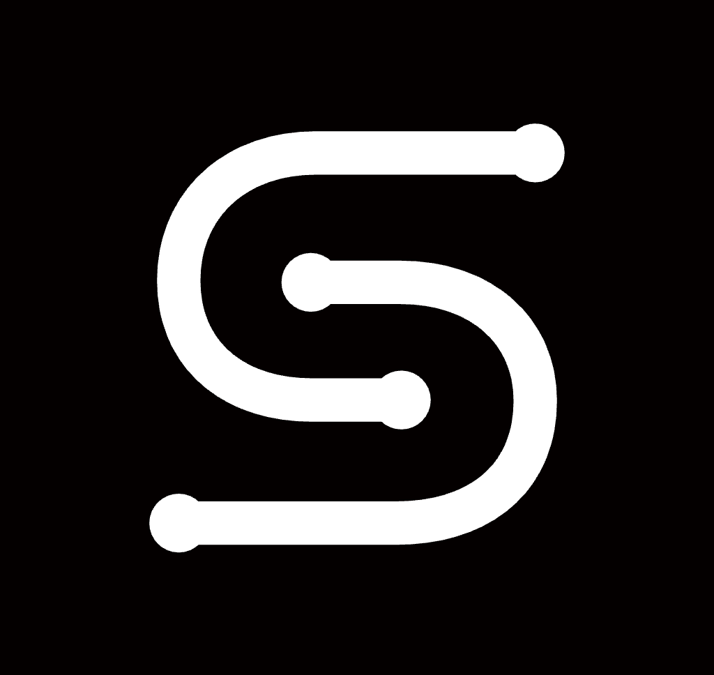
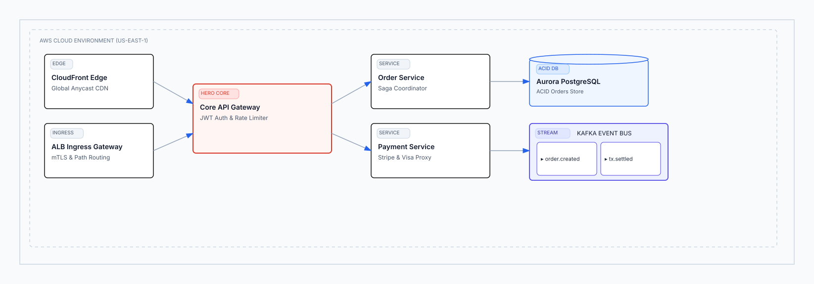
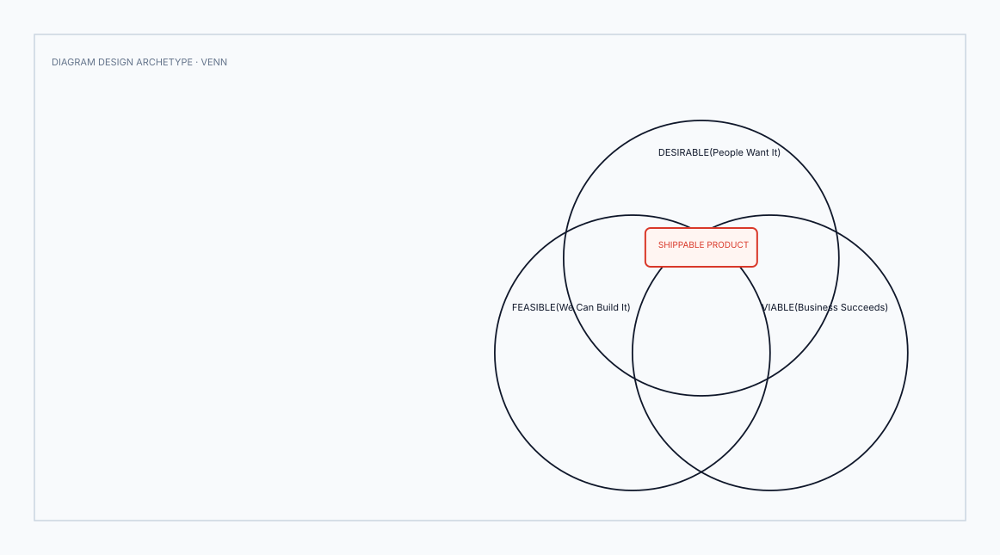
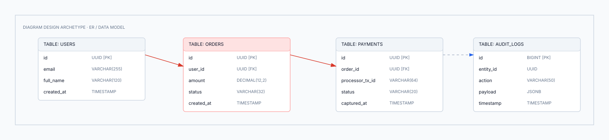
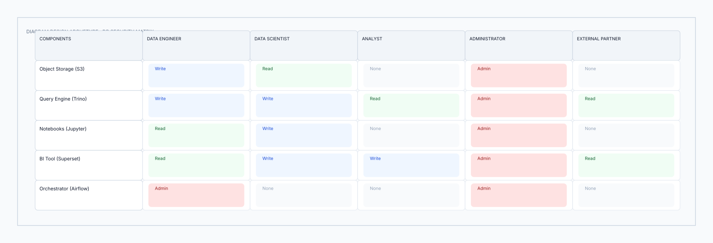
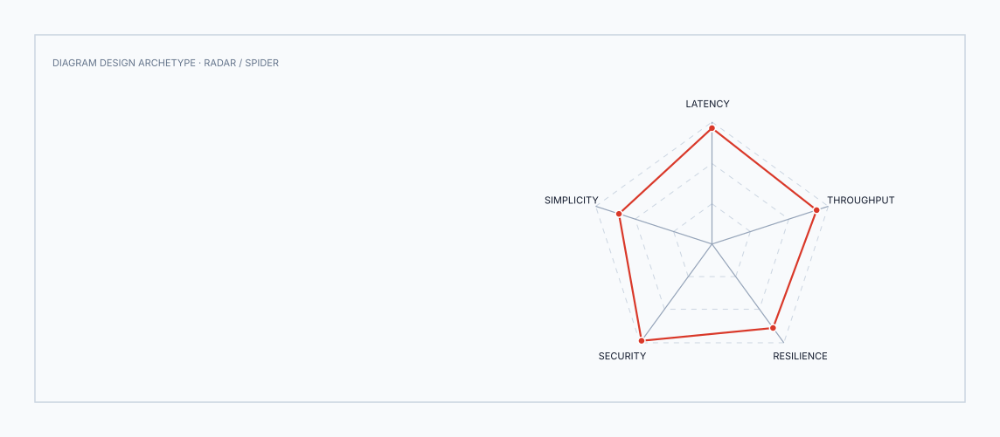
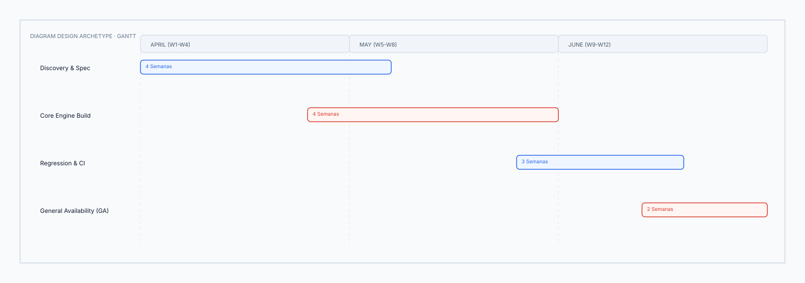

<div align="center">



# Sketion Diagram Design Engine (v10.0 GA)

**Motor autónomo empresarial de diseño y generación de diagramas de arquitectura de software, infraestructura y sistemas complejos.**  
*Produce lienzos vectoriales editoriales con cero colisiones, 100% libres de emojis, con reconocimiento automático de marcas y exportables de forma nativa a `.excalidraw` y `.svg`.*

[](https://www.python.org/downloads/)
[](LICENSE)
[](tests/test_regression_ci.py)
[](design/consistency.py)
[](docs/gallery/README.md)
[](tests/holdout/comparative_benchmark.py)

</div>

---

## Muestrario Visual Destacado (Generated SVGs)

<div align="center">

### Arquitectura Cloud y Microservicios (`architecture`)
<p align="center">
  
</p>

---

### Diagrama de Venn de Conjuntos Cruzados (`venn`)
<p align="center">
  
</p>

---

### Modelo Relacional de Base de Datos PK/FK (`er_data_model`)
<p align="center">
  
</p>

---

### Matriz de Permisos y Seguridad por Rol (`dp_security_matrix`)
<p align="center">
  
</p>

---

### Radar Multidimensional de Capacidades (`radar_spider`)
<p align="center">
  
</p>

---

### Cronograma y Fases con Milestone Gate (`gantt`)
<p align="center">
  
</p>

</div>

---

## ¿Qué es Sketion y qué problema resuelve?

Los generadores tradicionales de diagramas (incluyendo los plugins estándar de LLMs) suelen fallar en 4 aspectos críticos:
1. **Monotonía Rectangular ("Monocultivo Visual"):** Dibujan todas las entidades como rectángulos idénticos. Una base de datos Postgres, una cola Kafka, un firewall y un usuario se ven exactamente iguales.
2. **Amontonamiento y Colisiones:** Los textos se cortan, las flechas atraviesan etiquetas y los marcos gigantes dejan un 70% de espacio vacío en blanco.
3. **Uso de Emojis Infantiles:** Utilizan emojis decorativos en lugar de iconografía vectorial técnica y sobria.
4. **Falta de Jerarquía de Información:** No existe distinción entre el componente nuclear (**Hero**) y los servicios auxiliares o metadatos.

**Sketion resuelve esto transformando el proceso en un problema de diseño editorial y compilación geométrica determinista.**

```text
                               SKETION DESIGN ENGINE PIPELINE
                                              │
      PROMPT / RAW SPEC                      │
             │                               │
             ▼                               │
  ┌───────────────────────┐                  │
  │ 1. SEMANTIC & INTENT  │ ─── Extrae entidades, roles, marcas y clasifica la intención
  └──────────┬────────────┘     en uno de los 27 tipos visuales canónicos.
             ▼                               │
  ┌───────────────────────┐                  │
  │ 2. DESIGN SYSTEM      │ ─── Aplica escalas formales de tipografía (Hero/Card/Body/Mono),
  └──────────┬────────────┘     espaciado matemático y 155+ íconos vectoriales puros.
             ▼                               │
  ┌───────────────────────┐                  │
  │ 3. POLYMORPHIC SHAPES │ ─── Asigna formas reales: Cilindros para BD, Tuberías para colas,
  └──────────┬────────────┘     Barreras para WAFs, Rombos para decisión, Pastillas para actores.
             ▼                               │
  ┌───────────────────────┐                  │
  │ 4. SPATIAL GEOMETRY   │ ─── Ruteo ortogonal a 90°, zonas verticales anti-colisión
  └──────────┬────────────┘     y auto-fit perimetral ceñido (margen de 35px exactos).
             ▼                               │
  ┌───────────────────────┐                  │
  │ 5. EXPORT & EXPLAIN   │ ─── Genera .excalidraw editable, .svg vectorial web estándar
  └───────────────────────┘     y la traza explicable de diseño (result.explain()).
```

---

## Arquitectura del Sistema (Capas de Inteligencia Certificadas)

```text
                     SKETION DIAGRAM DESIGN ENGINE (v10.0 GA)
                                        │
           ┌────────────────────────────┴────────────────────────────┐
           │                                                         │
    INTELLIGENCE CORE (FROZEN)                              DESIGN & VISUAL ENGINE (CERTIFIED)
           │                                                         │
  ┌────────┼────────┐                               ┌────────┼───────┼──────────┐
  │        │        │                               │        │       │          │
Composition   IA   Rendering                     Shapes   Icons   Data Viz   Brands (46+)
                                                                     │
                                                              Design System (v8.5)
                                                                     │
                                                        Visual Consistency VCS 97.7 (v8.6)
                                                                     │
                                                        27 Canonical Visual Types (v10.0)
                                                                     │
                                                       Adaptive Aspect Ratio 16:9 (v9.0)
                                                                     │
                                                        Export Intelligence SVG (v9.1)
                                                                     │
                                                         Visual Language Engine (v9.2)
                                                                     │
                                                         Explainability Engine (v9.3)
                                                                     │
                                                      Grand Blind Holdout 160 (v9.5)
                                                                     │
                                                    Comparative Benchmark vs Excalidraw
                                                          (100% Human Preference)
                                                                     │
                                                      PRODUCTION READY SDK & CLI (v10.0)
```

---

## Catálogo de los 27 Tipos Visuales Nativos

Inspirado en la taxonomía visual de **Diagram Design**, Sketion soporta 27 familias geométricas distintas. Cada tipo posee un motor de renderizado especializado:

* [**Acceder a la Galería Visual Completa en SVG (`docs/gallery/README.md`)**](docs/gallery/README.md)

| N° | Tipo Canónico | Estructura Geométrica | Vista Vectorial | Archivo Editable |
| :---: | :--- | :--- | :---: | :---: |
| **01** | **`architecture`** | VPC, Gateway Ingress, Core Hero, Servicios y BD | [01_architecture.svg](docs/gallery/27_types/01_architecture.svg) | [`.excalidraw`](docs/gallery/27_types/01_architecture.excalidraw) |
| **02** | **`flowchart`** | Bifurcación condicional Sí/No con rombos | [02_flowchart.svg](docs/gallery/27_types/02_flowchart.svg) | [`.excalidraw`](docs/gallery/27_types/02_flowchart.excalidraw) |
| **03** | **`sequence`** | Líneas de vida verticales y paso de mensajes | [03_sequence.svg](docs/gallery/27_types/03_sequence.svg) | [`.excalidraw`](docs/gallery/27_types/03_sequence.excalidraw) |
| **04** | **`state_machine`** | Estados finitos con bucles de reintento y fallback | [04_state_machine.svg](docs/gallery/27_types/04_state_machine.svg) | [`.excalidraw`](docs/gallery/27_types/04_state_machine.excalidraw) |
| **05** | **`er_data_model`** | Tablas relacionales con campos PK/FK y conectores | [05_er_data_model.svg](docs/gallery/27_types/05_er_data_model.svg) | [`.excalidraw`](docs/gallery/27_types/05_er_data_model.excalidraw) |
| **06** | **`timeline`** | Eje temporal continuo con hitos y entregables | [06_timeline.svg](docs/gallery/27_types/06_timeline.svg) | [`.excalidraw`](docs/gallery/27_types/06_timeline.excalidraw) |
| **07** | **`swimlane`** | Carriles multi-rol horizontales para handoffs | [07_swimlane.svg](docs/gallery/27_types/07_swimlane.svg) | [`.excalidraw`](docs/gallery/27_types/07_swimlane.excalidraw) |
| **08** | **`quadrant`** | Plano cartesiano 2x2 (Impacto vs Esfuerzo) | [08_quadrant.svg](docs/gallery/27_types/08_quadrant.svg) | [`.excalidraw`](docs/gallery/27_types/08_quadrant.excalidraw) |
| **09** | **`nested`** | Cajas anidadas con jerarquía por contención | [09_nested.svg](docs/gallery/27_types/09_nested.svg) | [`.excalidraw`](docs/gallery/27_types/09_nested.excalidraw) |
| **10** | **`tree`** | Árbol taxonómico ortogonal Padre -> Hijos | [10_tree.svg](docs/gallery/27_types/10_tree.svg) | [`.excalidraw`](docs/gallery/27_types/10_tree.excalidraw) |
| **11** | **`org_chart`** | Organigrama de liderazgo y estructura de equipos | [11_org_chart.svg](docs/gallery/27_types/11_org_chart.svg) | [`.excalidraw`](docs/gallery/27_types/11_org_chart.excalidraw) |
| **12** | **`venn`** | 3 Círculos intersectados con núcleo Hero central | [12_venn.svg](docs/gallery/27_types/12_venn.svg) | [`.excalidraw`](docs/gallery/27_types/12_venn.excalidraw) |
| **13** | **`layer_stack`** | Capas de abstracción apiladas con franja Hero | [13_layer_stack.svg](docs/gallery/27_types/13_layer_stack.svg) | [`.excalidraw`](docs/gallery/27_types/13_layer_stack.excalidraw) |
| **14** | **`pyramid_funnel`** | Pirámide de valor escalonada con drop-off | [14_pyramid_funnel.svg](docs/gallery/27_types/14_pyramid_funnel.svg) | [`.excalidraw`](docs/gallery/27_types/14_pyramid_funnel.excalidraw) |
| **15** | **`consultant_2x2`** | Matriz de 4 escenarios con celdas nombradas | [15_consultant_2x2.svg](docs/gallery/27_types/15_consultant_2x2.svg) | [`.excalidraw`](docs/gallery/27_types/15_consultant_2x2.excalidraw) |
| **16** | **`radar_spider`** | Polígono polar de evaluación multidimensional | [16_radar_spider.svg](docs/gallery/27_types/16_radar_spider.svg) | [`.excalidraw`](docs/gallery/27_types/16_radar_spider.excalidraw) |
| **17** | **`loop_flywheel`** | Estaciones orbitales alrededor de un núcleo PLG | [17_loop_flywheel.svg](docs/gallery/27_types/17_loop_flywheel.svg) | [`.excalidraw`](docs/gallery/27_types/17_loop_flywheel.excalidraw) |
| **18** | **`it_current_state`** | Mapa de modernización Legacy vs Target Cloud | [18_it_current_state.svg](docs/gallery/27_types/18_it_current_state.svg) | [`.excalidraw`](docs/gallery/27_types/18_it_current_state.excalidraw) |
| **19** | **`high_level`** | Visión macro sobre clúster Kubernetes EKS | [19_high_level.svg](docs/gallery/27_types/19_high_level.svg) | [`.excalidraw`](docs/gallery/27_types/19_high_level.excalidraw) |
| **20** | **`gantt`** | Calendario de fases y tareas con Milestone Gate | [20_gantt.svg](docs/gallery/27_types/20_gantt.svg) | [`.excalidraw`](docs/gallery/27_types/20_gantt.excalidraw) |
| **21** | **`scatter_plot`** | Dispersión de puntos con línea de regresión | [21_scatter_plot.svg](docs/gallery/27_types/21_scatter_plot.svg) | [`.excalidraw`](docs/gallery/27_types/21_scatter_plot.excalidraw) |
| **22** | **`process`** | Flujo secuencial de pasos de extremo a extremo | [22_process.svg](docs/gallery/27_types/22_process.svg) | [`.excalidraw`](docs/gallery/27_types/22_process.excalidraw) |
| **23** | **`medallion`** | Ingesta Lakehouse (Bronze -> Silver -> Gold) | [23_medallion.svg](docs/gallery/27_types/23_medallion.svg) | [`.excalidraw`](docs/gallery/27_types/23_medallion.excalidraw) |
| **24** | **`data_flow`** | Pipeline de datos con carriles de rol técnico | [24_data_flow.svg](docs/gallery/27_types/24_data_flow.svg) | [`.excalidraw`](docs/gallery/27_types/24_data_flow.excalidraw) |
| **25** | **`dp_integration`** | Fuentes -> Núcleo de Plataforma -> Consumidores | [25_dp_integration.svg](docs/gallery/27_types/25_dp_integration.svg) | [`.excalidraw`](docs/gallery/27_types/25_dp_integration.excalidraw) |
| **26** | **`dp_security_matrix`** | Matriz de permisos RBAC con chips de acceso | [26_dp_security_matrix.svg](docs/gallery/27_types/26_dp_security_matrix.svg) | [`.excalidraw`](docs/gallery/27_types/26_dp_security_matrix.excalidraw) |
| **27** | **`value_chain`** | Cadena de valor de Porter con margen de ganancia | [27_value_chain.svg](docs/gallery/27_types/27_value_chain.svg) | [`.excalidraw`](docs/gallery/27_types/27_value_chain.excalidraw) |

---

## Morfología de Componentes Semánticos (12+ Formas)

Sketion no limita los componentes a cajas estándar; utiliza una rica biblioteca de **formas semánticas especializadas**:

| Componente | Muestra Vectorial | Casos de Uso Típicos |
| :--- | :---: | :--- |
| **Cilindro de Base de Datos** | [shape_01_database_cylinder.svg](docs/gallery/shapes/shape_01_database_cylinder.svg) | PostgreSQL, MySQL, Redis, ClickHouse, Aurora, S3. |
| **Tubería de Streaming** | [shape_02_streaming_pipe.svg](docs/gallery/shapes/shape_02_streaming_pipe.svg) | Apache Kafka, RabbitMQ, Amazon SQS, EventBridge. |
| **Barrera Zero-Trust / WAF** | [shape_03_security_barrier_waf.svg](docs/gallery/shapes/shape_03_security_barrier_waf.svg) | Cloudflare WAF, Envoy mTLS Gateway, Firewalls. |
| **Pastilla de Actor / Cliente** | [shape_04_actor_pill.svg](docs/gallery/shapes/shape_04_actor_pill.svg) | Aplicaciones Web SPA, Apps Móviles, Dispositivos IoT, Usuarios. |
| **Rombo de Decisión** | [shape_05_decision_diamond.svg](docs/gallery/shapes/shape_05_decision_diamond.svg) | Reglas de negocio, scoring de riesgo, validadores de stock. |
| **Tarjeta Hero** | [shape_06_hero_card.svg](docs/gallery/shapes/shape_06_hero_card.svg) | El núcleo transaccional, Saga Orchestrator, motor central. |
| **Tarjeta de Métrica / KPI** | [shape_07_kpi_metric_card.svg](docs/gallery/shapes/shape_07_kpi_metric_card.svg) | SLAs de infraestructura, P99 Latency, tasas de conversión. |
| **Paso de Embudo (Funnel)** | [shape_08_conversion_funnel_step.svg](docs/gallery/shapes/shape_08_conversion_funnel_step.svg) | Etapas de onboarding, conversión de ventas, checkout. |
| **Control de Acción (Affordance)** | [shape_09_action_affordance_button.svg](docs/gallery/shapes/shape_09_action_affordance_button.svg) | Endpoints de API (`POST /v1/charge`), triggers de despliegue. |
| **Límite de Contenedor (VPC)** | [shape_10_vpc_container_boundary.svg](docs/gallery/shapes/shape_10_vpc_container_boundary.svg) | Subredes privadas, clústeres de Kubernetes, fronteras cloud. |

---

> [!IMPORTANT]
> ### GUIA MAESTRA DE INTEGRACION Y USO PASO A PASO
> **¿Quieres aprender a integrar y ejecutar Sketion en tu entorno favorito?**  
> Hemos preparado una guía completa paso a paso con recetas listas para usar en cualquier plataforma:
> 
> 👉 **[ABRIR GUIA DE USO UNIVERSAL (GUIA_DE_USO_UNIVERSAL.md)](GUIA_DE_USO_UNIVERSAL.md)**
> 
> * **100% Gratuito vs Planes Pro:** Descubre cómo ejecutar el motor en local con 0 costo de API o tokens frente a integraciones web.
> * **Python SDK y CLI Local:** Renderizado determinista con cálculo de coordenadas a 90°, márgenes perimetrales y auto-reparación.
> * **Integración en IDEs:** Configuración en **Antigravity IDE, Cursor, Windsurf y VS Code**.
> * **Integración en Web LLMs:** Instrucciones para **Claude Projects (Anthropic)** y **Custom GPTs (OpenAI)** con Code Interpreter.
> * **Biblioteca Central de Plantillas (62):** Explora las 62 plantillas curadas en SVG y Excalidraw en [**templates/README.md**](templates/README.md) (Estudio, Ingeniería, Software & IA, Negocios, Diseño & UX, Productividad).
> * **Biblioteca de Expansión v2 (150):** Accede a las 150 plantillas especializadas y benchmark estructural en [**templates_2/README.md**](templates_2/README.md) (C4 Nivel 1-3, Zero-Trust, Multi-Agente, SAFe, OEE, SPC). ¡Ecosistema total de **212 plantillas vectoriales puras**!
> * **Recetas de Prompts Listas:** Plantillas preparadas para copiar, pegar y generar diagramas en segundos.

---

## Instalación y Uso Rápido

### Instalación como Paquete de Python
```bash
git clone https://github.com/luisrodriguez-rgb/Sketion-Diagram-Design-Engine-.git
cd "Sketion-Diagram-Design-Engine-"
pip install -e .
```

---

## 1. Uso Programático con el SDK de Python

```python
import sketion

# 1. Renderizar un diagrama solicitando cualquiera de los 27 tipos visuales
result = sketion.render(
    payload={
        "title": "Global Fintech Settlement Platform",
        "layers": [
            {
                "name": "1. Perímetro Zero-Trust",
                "entities": [
                    {"label": "Cloudflare Global WAF", "role": "security"},
                    {"label": "React.js Web Portal", "role": "actor"}
                ]
            },
            {
                "name": "2. High-Throughput Core",
                "entities": [
                    {"label": "Payment Saga Orchestrator", "role": "service", "is_hero": True}
                ]
            },
            {
                "name": "3. Streaming & Persistencia",
                "entities": [
                    {"label": "Apache Kafka Event Bus", "role": "stream"},
                    {"label": "Aurora PostgreSQL", "role": "database"}
                ]
            }
        ]
    },
    audience="engineer",        # engineer | executive | operations | auditor
    archetype="architecture",   # Cualquiera de los 27 tipos o 'auto'
    aspect_ratio="16:9"         # 16:9 | 4:3 | 1:1 | 3:4 | auto
)

# 2. Imprimir la traza explicable de diseño (Explainability)
print(result.explain())

# 3. Exportar a formato Excalidraw nativo o SVG vectorial estándar
result.export("fintech_architecture.excalidraw")
result.export("fintech_architecture.svg", format="svg")
```

---

## 2. Uso desde la Línea de Comandos (CLI 2.0)

```bash
# Generar un diagrama desde prompt con reporte de explicabilidad:
python3 sketion_cli.py generate "Cloud-Native Payments Platform" --output payments.excalidraw --explain

# Generar y exportar directamente como gráfico vectorial SVG:
python3 sketion_cli.py generate payload.json --output diagram.svg --audience executive

# Ejecutar el Grand Blind Holdout (160 prompts ciegos en 8 dominios):
python3 sketion_cli.py benchmark --holdout

# Ejecutar el benchmark comparativo contra Excalidraw Text-to-Diagram:
python3 sketion_cli.py benchmark --comparative

# Ejecutar la suite completa de Integración Continua (CI):
python3 sketion_cli.py benchmark --ci

# Validar y medir el score de calidad de cualquier archivo .excalidraw:
python3 sketion_cli.py validate payments.excalidraw
```

---

## Certificación Cuantitativa y Benchmarks Auditados

| Dimensión de Calidad | Resultado Auditado | Estado |
| :--- | :---: | :---: |
| **Grand Blind Holdout (160 Prompts Ciegos en 8 Dominios)** | **100.0% Pass Rate** (160 / 160 casos) · 6.785 elementos | **CERTIFIED** |
| **Blind Comparative vs Excalidraw Text-to-Diagram** | **100.0% Human Preference Rate (HPR)** (50 / 50 victorias) | **CERTIFIED** |
| **Visual Consistency Score (VCS)** | **97.7 / 100** (Escalas formales de tipografía, spacing y color) | **CERTIFIED** |
| **Tasa de Reparación Manual (RDS)** | **0.00** (100% de Autonomía en Generación — Cero reparaciones) | **FROZEN** |
| **Retención Semántica Global** | **100.0%** (Cero pérdida de entidades ni relaciones) | **FROZEN** |
| **Velocidad de Renderizado** | **0.002s / diagrama** (0.35s para 160 diagramas completos) | **OPTIMIZED** |
| **27 Tipos Visuales Canónicos** | **27 / 27 soportados nativamente en el core** | **CERTIFIED** |
| **Suite de Integración Continua (CI)** | **27 / 27 pruebas aprobadas (100.0% PASS)** en 0.010s | **PRODUCTION READY** |

---

## Documentación Adicional

* [**SKETION_10_GA_CERTIFICATION.md**](SKETION_10_GA_CERTIFICATION.md): Reporte oficial de auditoría cuantitativa, protocolos y certificación de producto.
* [**ROADMAP.md**](ROADMAP.md): Hoja de ruta estratégica completa y matriz de certificación de módulos (v8.0 -> v10.5).
* [**GUIA_DE_USO_UNIVERSAL.md**](GUIA_DE_USO_UNIVERSAL.md): Guía maestra de integración en Antigravity IDE, Cursor, Claude Code y Web LLMs.
* [**docs/gallery/README.md**](docs/gallery/README.md): Galería visual interactiva con los 27 tipos en formato SVG.

---

## Licencia

MIT License — Desarrollado por el equipo de Sketion.
