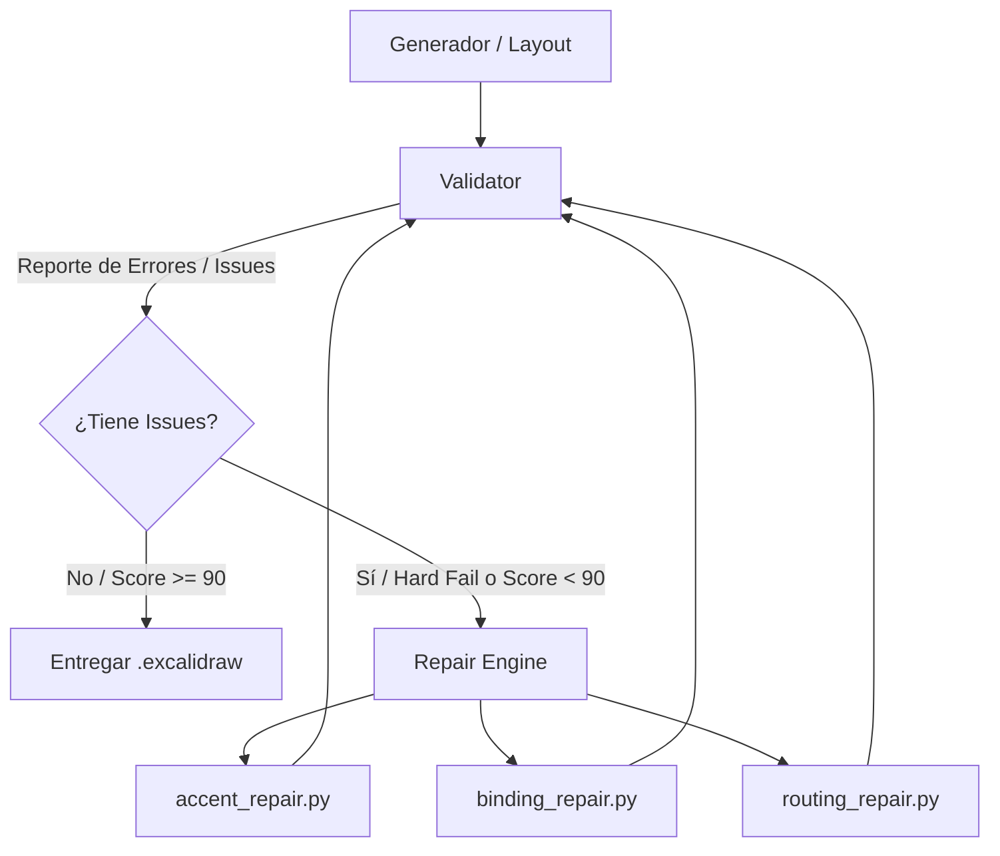

# Hoja de Ruta Priorizada y Especificación de Mejoras (Sketion Engine)

Este documento define la **priorización estratégica y arquitectura técnica** de las 10 mejoras clave de Sketion, estructuradas en 4 fases de entrega según su impacto y valor de producto.

---

## 🎯 Tabla de Priorización Estratégica

| Prioridad | # | Mejora | Valor | Complejidad | Decisión & Fase |
| :--- | :---: | :--- | :---: | :---: | :--- |
| 🥇 **P0** | **7** | **Auto-Correction + Quality Score + `repair/`** | ⭐⭐⭐⭐⭐ | Alta | **Fase 1 (Core)** |
| 🥇 **P0** | **2** | **Scope / Zonas / Contenedores Semánticos** | ⭐⭐⭐⭐⭐ | Media-Alta | **Fase 1 (Core)** |
| 🥇 **P0** | **4** | **Doble Jerarquía de Tarjetas (Title + Mono Sublabel)** | ⭐⭐⭐⭐⭐ | Baja-Media | **Fase 1 (Core)** |
| 🥇 **P0** | **8** | **Output Spec Adaptativo (Preset $\rightarrow$ Layout/Fuentes)** | ⭐⭐⭐⭐⭐ | Baja | **Fase 1 (Core)** |
| 🥈 **P1** | **9** | **Visual Regression Testing (Fixtures & Snapshots)** | ⭐⭐⭐⭐ | Media | **Fase 1 (Core)** |
| 🥈 **P1** | **1** | **Mermaid Re-Draw (Flowchart, Sequence, ER)** | ⭐⭐⭐⭐⭐ | Alta | **Fase 2 (Ingesta)** |
| 🥈 **P1** | **6** | **`.sketion-profile` (Configuración de Marca en Repo)** | ⭐⭐⭐⭐ | Baja | **Fase 2 (Ingesta)** |
| 🥉 **P2** | **3** | **Canvas Legend Condicional e Inteligente** | ⭐⭐⭐ | Baja | **Fase 3 (Polish)** |
| 🥉 **P2** | **10**| **ADRs Continuos (`docs/adr/`)** | ⭐⭐⭐ | Baja | **Fase 3 (Polish)** |
| 🟦 **P3** | **5** | **Empaquetado Multi-Plataforma (Claude, Codex, Pi)** | ⭐⭐ | Baja | **Fase 4 (Distribución)** |

---

## 🏛️ FASE 1 — Core de Calidad (Implementación Inmediata)

```text
Sketion SKILL/
├── semantic/
│   ├── models.py             # Nodos con doble jerarquía, Scopes y OutputPreset
├── layout/
│   ├── flow.py
│   ├── hierarchy.py          # Cálculo de Bounding Box de Scopes y Zonas
│   ├── grid.py
│   └── routing.py            # Codos ortogonales 90º
├── render/
│   └── excalidraw_builder.py # Render de doble texto vinculado, scopes y presets
├── repair/                   # [NUEVO] Módulo dedicado de auto-reparación
│   ├── __init__.py
│   ├── accent_repair.py      # Degrada acentos excedentes respetando el foco principal
│   ├── binding_repair.py     # Re-sincroniza containerId y boundElements
│   └── engine.py             # Orquestador del bucle de corrección
├── validation/
│   ├── quality_score.py      # Hard Failures vs Quality Score (0-100)
│   └── validator.py          # Validador integral
└── tests/
    ├── fixtures/             # JSONs canónicos (login, architecture, saas, er, timeline)
    ├── snapshots/            # Archivos .excalidraw generados
    └── test_visual_regression.py
```

---

## 🔍 Especificación de las 4 Mejoras P0 de Fase 1

### 1. #4 — Doble Jerarquía de Tarjetas
Toda tarjeta de componente o servicio se descompone en 3 niveles de información:
```text
┌──────────────────────────────────────────────┐
│                  API Gateway                 │ <- 14px Sans Bold (fontFamily: 2)
│             single entry point :8080         │ <- 11px Mono (fontFamily: 3) #64748B
└──────────────────────────────────────────────┘
```
* **Modelo Semántico:** `SemanticNode(label="API Gateway", sublabel="single entry point", metadata=":8080", role="core", is_hero=True)`
* **Render Excalidraw:** Crea una caja con 2 textos vinculados de forma compacta y legible.

---

### 2. #2 — Scopes y Zonas Semánticas (Scope Containment)
Los nodos no flotan aislados; se engloban dentro de un `Scope`:
```text
┌── CORE SERVICES ────────────────────────────────────────────────────────┐
│  ┌───────────────────────┐          ┌───────────────────────┐          │
│  │      API Gateway      │          │      Auth Service     │          │
│  │   single entry point  │          │      token verify     │          │
│  └───────────────────────┘          └───────────────────────┘          │
└─────────────────────────────────────────────────────────────────────────┘
```
* **Modelo Semántico:** `Scope(id="core", label="CORE SERVICES", role="internal", node_ids=["api", "auth"])`
* **Layout:** Calcula el rectángulo envolvente de los nodos miembros $+ 35\text{px}$ de padding y añade la etiqueta mono en la esquina superior izquierda.

---

### 3. #8 — Output Spec Adaptativo
El preset de salida no solo cambia el tamaño del frame, sino que modifica activamente el layout y las tipografías:

| Preset | Contexto | Aspect Ratio / Tamaño | Escala Tipográfica | Gaps | Densidad Máxima |
| :--- | :--- | :---: | :---: | :---: | :---: |
| `presentation` | Pitch Decks / Slides | $16:9$ ($1600 \times 900$) | $+30\%$ | $80\text{px}$ | $\le 4.0/10$ |
| `docs` | README / Wiki / GitHub | Libre ($1200 \times 650$) | Normal ($100\%$) | $50\text{px}$ | $\le 5.0/10$ |
| `deep_dive` | Arquitectura Técnica | Full ($1800 \times 1000$) | Normal / Compacto | $40\text{px}$ | $\le 6.5/10$ |
| `social_og` | Twitter / LinkedIn Card | $1200 \times 630$ | $+20\%$ | $60\text{px}$ | $\le 4.0/10$ |

---

### 4. #7 — Arquitectura de Auto-Corrección Desacoplada (`repair/`)
Separamos la responsabilidad de **validar** de la responsabilidad de **reparar**:



---

## 🗺️ Fases Posteriores

* **FASE 2 — Ingesta e Inteligencia de Entrada (P1):**
  - Parser de Mermaid (`flowchart`, `sequenceDiagram`, `erDiagram`) $\rightarrow$ `SemanticDiagram` $\rightarrow$ Excalidraw.
  - Soporte de configuración `.sketion-profile` por repositorio.
* **FASE 3 — Polish y Documentación (P2):**
  - Leyenda inteligente condicional (solo si $\ge 3$ roles o líneas mixtas).
  - Registros de Decisiones Arquitectónicas (`docs/adr/`).
* **FASE 4 — Distribución y Plugins (P3):**
  - Manifiestos para Claude Code, Codex, Pi y Antigravity.
