

# Sketion Visual Showcase Gallery (v10.0 GA)

**Catálogo Canónico de los 27 Tipos Visuales de Diagram Design & Arquitectura Editorial.**  
*Todos los diagramas son generados por el motor de forma 100% autónoma y exportados en formato vectorial web estándar (`.svg`) y editable nativo (`.excalidraw`).*

---

## 1. Arquitectura y Sistemas de Información

### 01. Architecture (Components + Connections)
> **Propósito:** Diagrama de bloques estructurado en VPC con zonas de red Ingress, Core Hero, Microservicios y Base de Datos ACID.  
> [Descargar `.excalidraw`](27_types/01_architecture.excalidraw) · [Ver Vectorial `.svg`](27_types/01_architecture.svg)

  

---

### 19. High-Level (End-to-End Stack on a Cluster)
> **Propósito:** Visión macro end-to-end de una plataforma completa orquestada sobre un clúster Kubernetes Multi-AZ.  
> [Descargar `.excalidraw`](27_types/19_high_level.excalidraw) · [Ver Vectorial `.svg`](27_types/19_high_level.svg)

  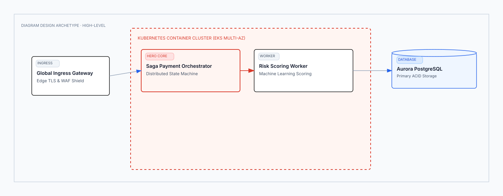

---

### 13. Layer Stack (Stacked Abstractions)
> **Propósito:** Pila de capas de abstracción funcionales con franja Hero para el motor transaccional.  
> [Descargar `.excalidraw`](27_types/13_layer_stack.excalidraw) · [Ver Vectorial `.svg`](27_types/13_layer_stack.svg)

  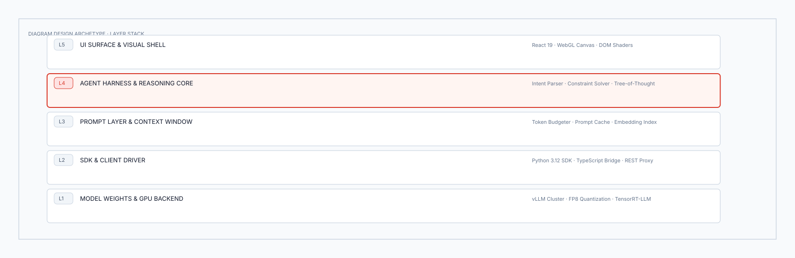

---

### 09. Nested (Hierarchy by Containment)
> **Propósito:** Jerarquía estricta por contención de cajas anidadas con sangría visual perimetral.  
> [Descargar `.excalidraw`](27_types/09_nested.excalidraw) · [Ver Vectorial `.svg`](27_types/09_nested.svg)

  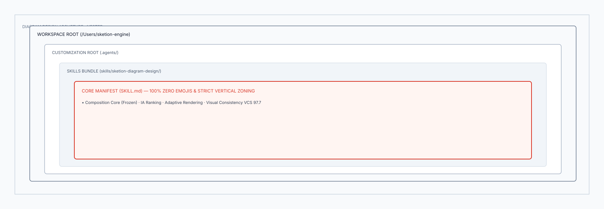

---

### 18. IT Current-State (Legacy vs Modernization Target)
> **Propósito:** Análisis de transformación digital contrastando el panorama Legacy on-premise frente al Target Cloud.  
> [Descargar `.excalidraw`](27_types/18_it_current_state.excalidraw) · [Ver Vectorial `.svg`](27_types/18_it_current_state.svg)

  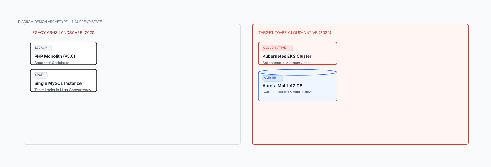

---

## 2. Flujo, Procesos y Lógica de Ejecución

### 02. Flowchart (Decision Logic & Branching)
> **Propósito:** Lógica condicional de negocio con bifurcaciones Sí/No mediante rombos de decisión.  
> [Descargar `.excalidraw`](27_types/02_flowchart.excalidraw) · [Ver Vectorial `.svg`](27_types/02_flowchart.svg)

  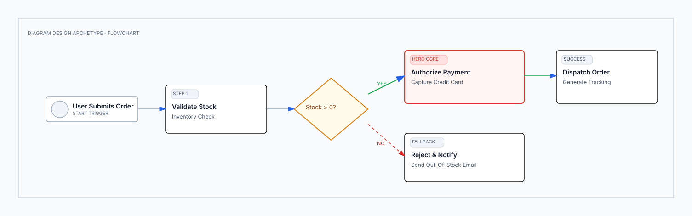

---

### 03. Sequence (Messages Over Time)
> **Propósito:** Mensajería temporal asíncrona y llamadas sincrónicas entre líneas de vida verticales.  
> [Descargar `.excalidraw`](27_types/03_sequence.excalidraw) · [Ver Vectorial `.svg`](27_types/03_sequence.svg)

  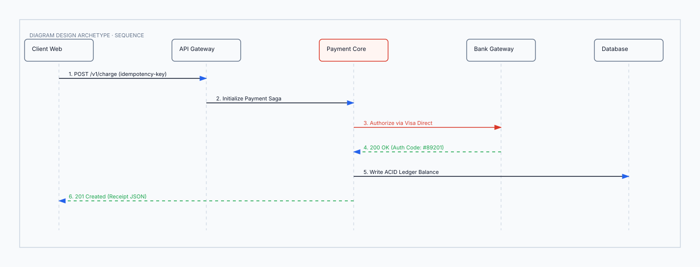

---

### 04. State Machine (States + Transitions)
> **Propósito:** Estados finitos de un ciclo de vida con transiciones ordenadas, bucles de reintento y fallback.  
> [Descargar `.excalidraw`](27_types/04_state_machine.excalidraw) · [Ver Vectorial `.svg`](27_types/04_state_machine.svg)

  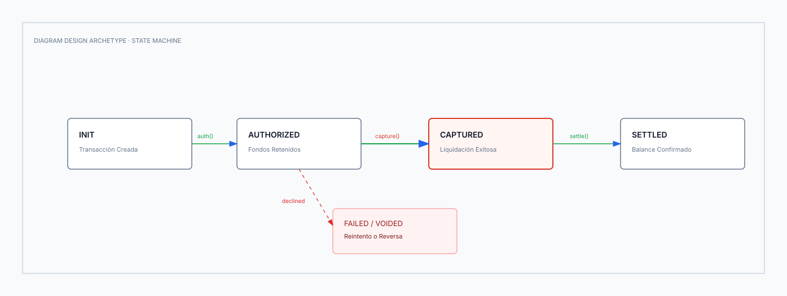

---

### 07. Swimlane (Cross-Functional Flow)
> **Propósito:** Flujo de proceso multi-rol distribuido horizontalmente a través de carriles de responsabilidad.  
> [Descargar `.excalidraw`](27_types/07_swimlane.excalidraw) · [Ver Vectorial `.svg`](27_types/07_swimlane.svg)

  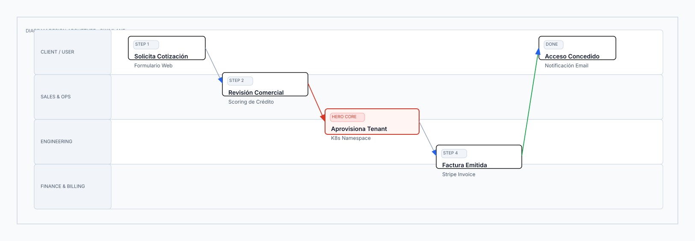

---

### 22. Process (Multi-Actor Sequential Workflow)
> **Propósito:** Cadena secuencial de pasos de extremo a extremo con hitos de validación intermedios.  
> [Descargar `.excalidraw`](27_types/22_process.excalidraw) · [Ver Vectorial `.svg`](27_types/22_process.svg)

  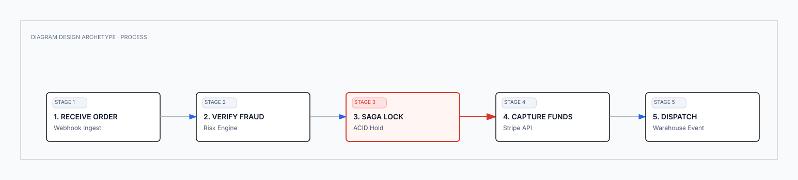

---

## 3. Datos, Almacenamiento e Integración

### 05. ER / Data Model (Entities + Fields)
> **Propósito:** Esquema de entidades de base de datos relacional con columnas tipadas, llaves PK/FK y relaciones.  
> [Descargar `.excalidraw`](27_types/05_er_data_model.excalidraw) · [Ver Vectorial `.svg`](27_types/05_er_data_model.svg)

  

---

### 23. Medallion (Bronze -> Silver -> Gold Lakehouse)
> **Propósito:** Arquitectura Lakehouse de ingestión multi-capa con conectores en arco superior.  
> [Descargar `.excalidraw`](27_types/23_medallion.excalidraw) · [Ver Vectorial `.svg`](27_types/23_medallion.svg)

  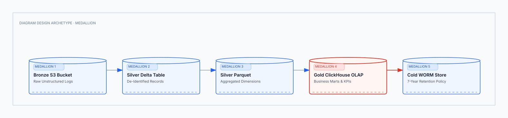

---

### 24. Data Flow (Role-Scoped Pipeline Steps)
> **Propósito:** Pasos de transformación de datos acotados por carril de rol de ingeniería.  
> [Descargar `.excalidraw`](27_types/24_data_flow.excalidraw) · [Ver Vectorial `.svg`](27_types/24_data_flow.svg)

  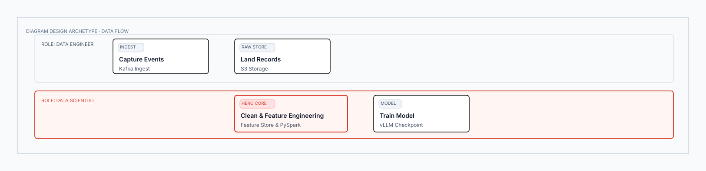

---

### 25. DP Integration (Sources -> Core -> Consumers)
> **Propósito:** Topología de integración de fuentes de datos hacia el núcleo de procesamiento y consumidores finales.  
> [Descargar `.excalidraw`](27_types/25_dp_integration.excalidraw) · [Ver Vectorial `.svg`](27_types/25_dp_integration.svg)

  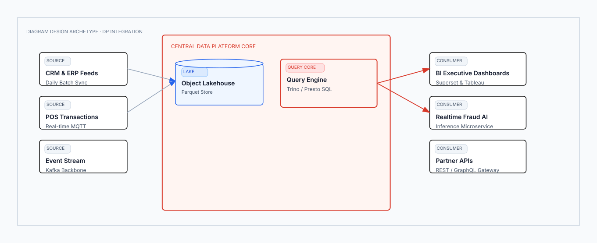

---

### 26. DP Security Matrix (Role-Based Access Matrix)
> **Propósito:** Matriz tabular de permisos de acceso con chips de color por rol (Admin, Write, Read, None).  
> [Descargar `.excalidraw`](27_types/26_dp_security_matrix.excalidraw) · [Ver Vectorial `.svg`](27_types/26_dp_security_matrix.svg)

  

---

## 4. Estrategia, Negocio y Jerarquía

### 12. Venn (3-Set Overlap & Intersection Core)
> **Propósito:** Solapamiento de 3 conjuntos circulares con núcleo central Hero de producto enviable.  
> [Descargar `.excalidraw`](27_types/12_venn.excalidraw) · [Ver Vectorial `.svg`](27_types/12_venn.svg)

  

---

### 14. Pyramid / Funnel (Ranked Hierarchy & Drop-Off)
> **Propósito:** Jerarquía piramidal escalonada con porcentajes de conversión y cúspide Hero.  
> [Descargar `.excalidraw`](27_types/14_pyramid_funnel.excalidraw) · [Ver Vectorial `.svg`](27_types/14_pyramid_funnel.svg)

  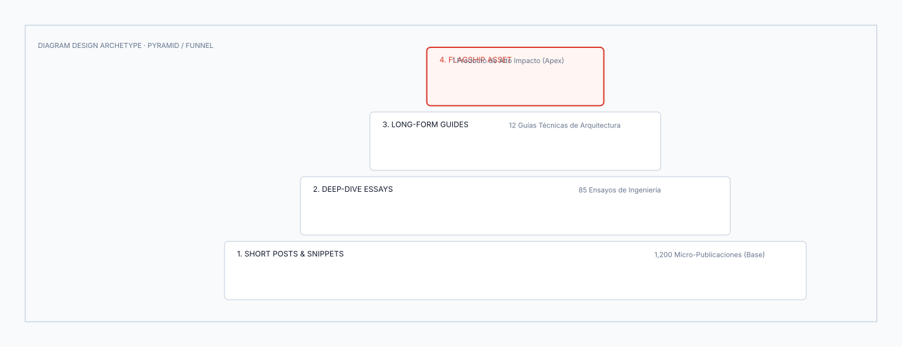

---

### 15. Consultant 2x2 (Scenario Matrix with Named Cells)
> **Propósito:** Matriz de 4 cuadrantes con celdas nombradas para toma de decisiones y evaluación de riesgo.  
> [Descargar `.excalidraw`](27_types/15_consultant_2x2.excalidraw) · [Ver Vectorial `.svg`](27_types/15_consultant_2x2.svg)

  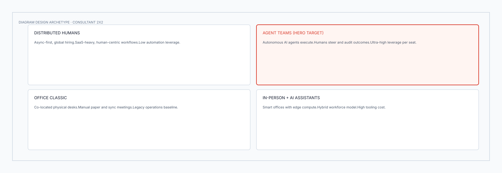

---

### 08. Quadrant (Two-Axis Positioning)
> **Propósito:** Posicionamiento en ejes continuos X * Y (Impacto vs Esfuerzo) con grupos de puntos.  
> [Descargar `.excalidraw`](27_types/08_quadrant.excalidraw) · [Ver Vectorial `.svg`](27_types/08_quadrant.svg)

  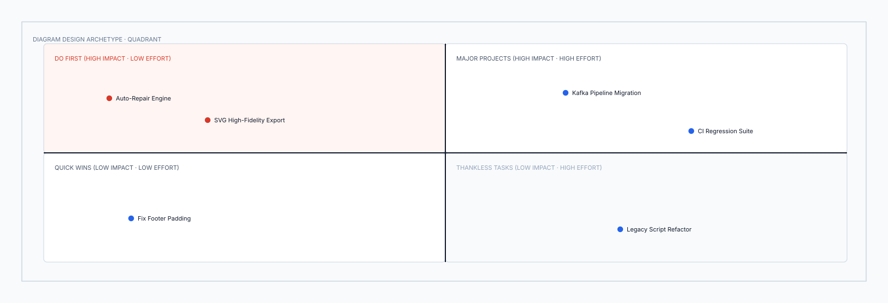

---

### 17. Loop (Flywheel Growth Stations)
> **Propósito:** Estaciones orbitales continuas alrededor de un centro de crecimiento (Product-Led Growth).  
> [Descargar `.excalidraw`](27_types/17_loop_flywheel.excalidraw) · [Ver Vectorial `.svg`](27_types/17_loop_flywheel.svg)

  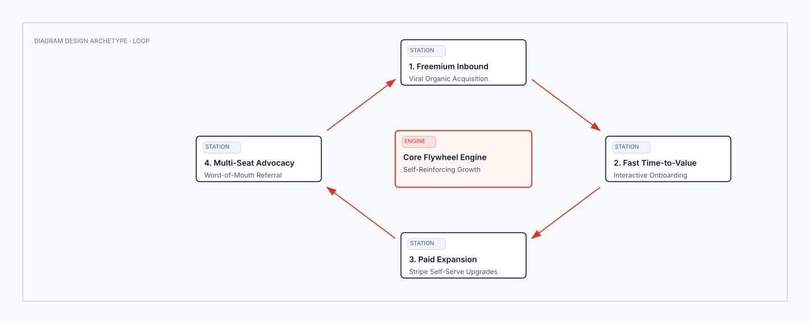

---

### 10. Tree (Parent -> Children Hierarchy)
> **Propósito:** Desglose taxonómico ortogonal ramificado desde el nodo raíz hacia las hojas.  
> [Descargar `.excalidraw`](27_types/10_tree.excalidraw) · [Ver Vectorial `.svg`](27_types/10_tree.svg)

  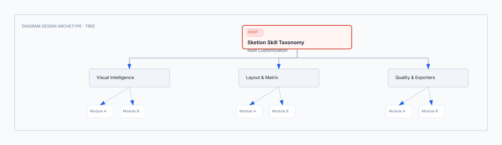

---

### 11. Org Chart (Ownership & Reporting Routing)
> **Propósito:** Estructura organizativa de liderazgo ejecutivo, directores y líderes de equipo.  
> [Descargar `.excalidraw`](27_types/11_org_chart.excalidraw) · [Ver Vectorial `.svg`](27_types/11_org_chart.svg)

  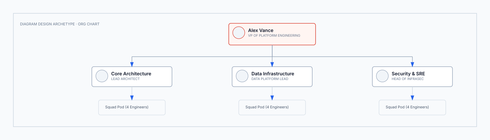

---

### 27. Value Chain (Porter Enterprise Value Flow)
> **Propósito:** Cadena de valor empresarial con actividades primarias y bloque terminal de margen de beneficio.  
> [Descargar `.excalidraw`](27_types/27_value_chain.excalidraw) · [Ver Vectorial `.svg`](27_types/27_value_chain.svg)

  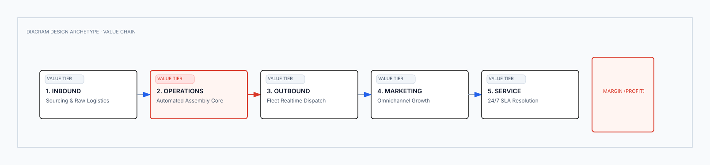

---

## 5. Analítica, Métricas y Planificación

### 06. Timeline (Events on an Axis)
> **Propósito:** Hitos, entregables y fases sobre una línea de tiempo horizontal continua.  
> [Descargar `.excalidraw`](27_types/06_timeline.excalidraw) · [Ver Vectorial `.svg`](27_types/06_timeline.svg)

  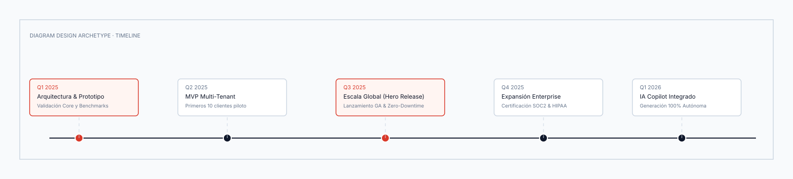

---

### 20. Gantt (Tasks & Calendar Phases with Milestone Gate)
> **Propósito:** Cronograma de proyectos con barras de semanas, dependencias y rombo de pase a producción.  
> [Descargar `.excalidraw`](27_types/20_gantt.excalidraw) · [Ver Vectorial `.svg`](27_types/20_gantt.svg)

  

---

### 16. Radar / Spider (Multi-Axis Polar Comparison)
> **Propósito:** Polígono polar de evaluación de competencias y capacidades multidimensionales en 5 ejes.  
> [Descargar `.excalidraw`](27_types/16_radar_spider.excalidraw) · [Ver Vectorial `.svg`](27_types/16_radar_spider.svg)

  

---

### 21. Scatter Plot (Distribution & Trendline)
> **Propósito:** Gráfico de dispersión de datos con puntos discretos y línea de regresión punteada.  
> [Descargar `.excalidraw`](27_types/21_scatter_plot.excalidraw) · [Ver Vectorial `.svg`](27_types/21_scatter_plot.svg)

  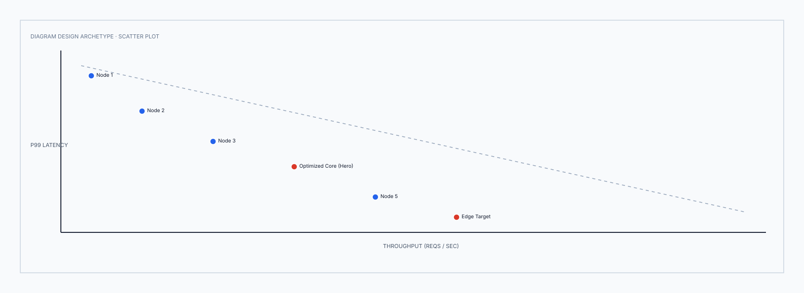

---

## Primitivas Semánticas Especializadas ([`shapes/`](shapes/))
Muestrario de los 12 componentes visuales aislados:
* [Cilindro de Base de Datos](shapes/shape_01_database_cylinder.svg) · [Tubería Kafka](shapes/shape_02_streaming_pipe.svg) · [Barrera WAF](shapes/shape_03_security_barrier_waf.svg) · [Pastilla de Actor](shapes/shape_04_actor_pill.svg) · [Rombo de Decisión](shapes/shape_05_decision_diamond.svg) · [Tarjeta Hero](shapes/shape_06_hero_card.svg) · [Tarjeta KPI](shapes/shape_07_kpi_metric_card.svg) · [Paso de Embudo](shapes/shape_08_conversion_funnel_step.svg) · [Control de Acción](shapes/shape_09_action_affordance_button.svg) · [Límite VPC](shapes/shape_10_vpc_container_boundary.svg) · [Callout de Alerta](shapes/shape_11_alert_risk_callout.svg) · [Tarjeta Quad](shapes/shape_12_quad_card_standard.svg).
