<div align="center">


# Sketion Curated Template Library

**Colección Curada de 62 Plantillas Vectoriales de Alta Precisión**
*Renderizadas con tipografía Inter, ruteo a 90°, márgenes perimetrales controlados y 0 emojis*

</div>

---

## Estructura y Navegación del Catálogo

La biblioteca predeterminada de Sketion está diseñada como una **colección curada de alto impacto**, organizada bajo el principio de separación estricta entre **Contenido Temático**, **Origen** y **Acción de Creación**:

```text
+---------------------------------------------------------------------------------------+
|                               BIBLIOTECA DE PLANTILLAS                                |
|                                                                                       |
| Categorias: [ Todos ] [ Estudio ] [ Ingenieria ] [ Software & IA ]                    |
|             [ Negocios ] [ Diseno & UX ] [ Productividad ]                            |
|                                                                                       |
|                                 [ Buscar plantillas... ]                              |
+---------------------------------------------------------------------------------------+
| DESTACADAS (FEATURED - 15 Seleccionadas)                                              |
| [ Study Notes ] [ Mapa Mental ] [ SIPOC ] [ Ishikawa ] [ System Design ]              |
| [ Database Schema ] [ AI Agent ] [ Lean Canvas ] [ SWOT ] [ Customer Journey ]        |
| [ Kanban Board ] [ Sprint Retrospective ] ...                                         |
|                                                                                       |
|                                                           [ Ver todas las plantillas > ]
+---------------------------------------------------------------------------------------+
| ORIGEN:                                                                               |
| - Mis Plantillas                                                                      |
| - Plantillas del Equipo                                                               |
+---------------------------------------------------------------------------------------+
| ACCION:                                                                               |
| - [ Crear con IA (Gemini) ]                                                           |
+---------------------------------------------------------------------------------------+
```

---

## 15 Plantillas Destacadas (Featured Showcase)

A continuación se presentan las 15 plantillas esenciales curadas para visualización inmediata en la pantalla principal:

### 1. Estudio: Study Notes & Class Synthesis
Vectorial con Indicios (Cue column), Notas detalladas y Resumen ejecutivo al pie.
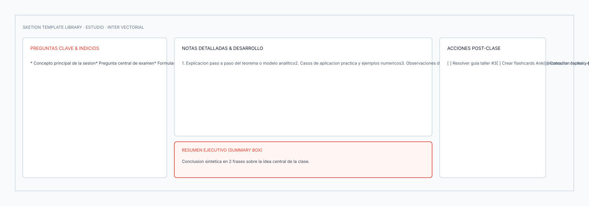
* [Descargar SVG](estudio/01_study_notes.svg) · [Descargar Excalidraw](estudio/01_study_notes.excalidraw)

---

### 2. Estudio: Mind Map Conceptual
Estructura radial con nodo central y ramas temáticas balanceadas.
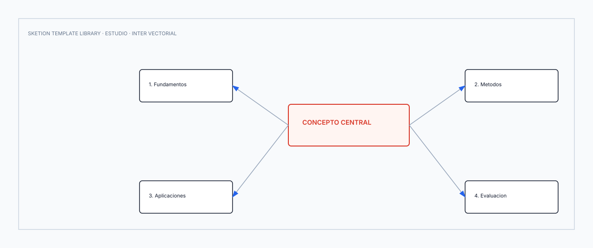
* [Descargar SVG](estudio/02_mind_map.svg) · [Descargar Excalidraw](estudio/02_mind_map.excalidraw)

---

### 3. Estudio: Exam Preparation Matrix
Matriz de planificación y seguimiento de estudio pre-examen con nivel de dificultad y estado.
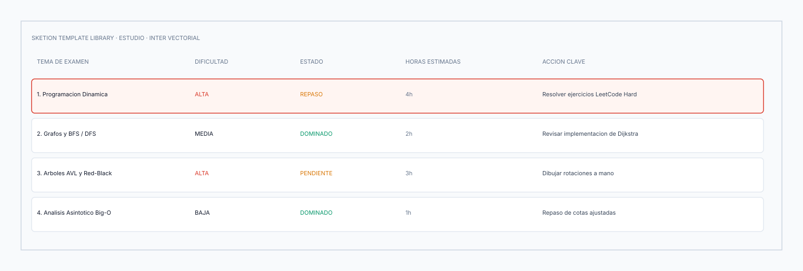
* [Descargar SVG](estudio/05_exam_prep.svg) · [Descargar Excalidraw](estudio/05_exam_prep.excalidraw)

---

### 4. Ingeniería: SIPOC Process Analysis
Mapeo de 5 columnas: Proveedores, Entradas, Proceso, Salidas y Clientes.
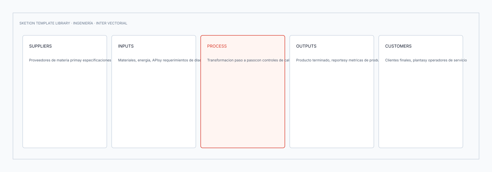
* [Descargar SVG](ingenieria/01_sipoc.svg) · [Descargar Excalidraw](ingenieria/01_sipoc.excalidraw)

---

### 5. Ingeniería: Value Stream Mapping (VSM)
Flujo de información, etapas operativas de proceso y cálculo de Lead Time vs Tiempo de Valor.
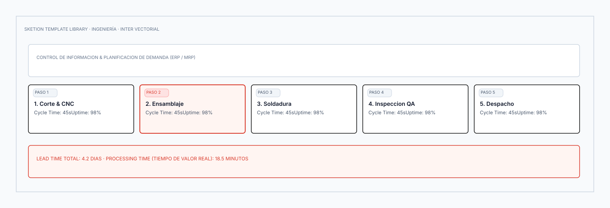
* [Descargar SVG](ingenieria/02_value_stream_mapping.svg) · [Descargar Excalidraw](ingenieria/02_value_stream_mapping.excalidraw)

---

### 6. Ingeniería: Diagrama de Ishikawa (Fishbone)
Espina de pescado con las 6Ms conectadas al problema central.
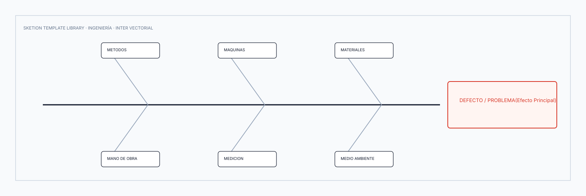
* [Descargar SVG](ingenieria/04_fishbone_ishikawa.svg) · [Descargar Excalidraw](ingenieria/04_fishbone_ishikawa.excalidraw)

---

### 7. Software & IA: System Design High-Scale Architecture
Arquitectura distribuida con DNS, CDN, Load Balancer, Microservicios, Cache Redis y Base de Datos.
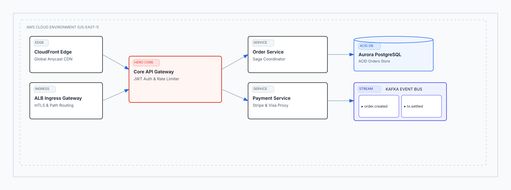
* [Descargar SVG](software_ia/01_system_design.svg) · [Descargar Excalidraw](software_ia/01_system_design.excalidraw)

---

### 8. Software & IA: Database Schema (Relational ER Model)
Modelo relacional con tablas normalizadas, claves primarias PK y foráneas FK.
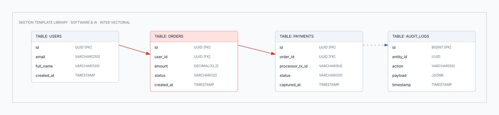
* [Descargar SVG](software_ia/04_database_schema.svg) · [Descargar Excalidraw](software_ia/04_database_schema.excalidraw)

---

### 9. Software & IA: Autonomous AI Agent Architecture
Arquitectura de Agente IA con módulo de percepción, memoria de corto/largo plazo, LLM y Tool Calling.
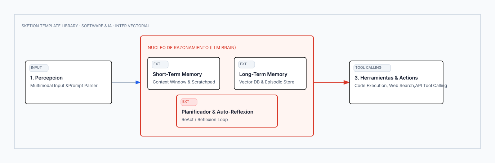
* [Descargar SVG](software_ia/09_ai_agent_architecture.svg) · [Descargar Excalidraw](software_ia/09_ai_agent_architecture.excalidraw)

---

### 10. Negocios: Lean Canvas Startup Framework
Los 9 bloques estratégicos para formulación de modelos de negocio rápidos.
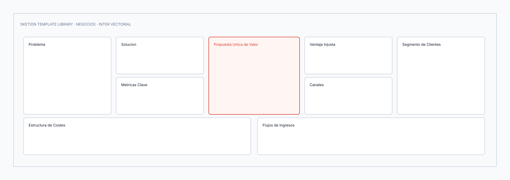
* [Descargar SVG](negocios/02_lean_canvas.svg) · [Descargar Excalidraw](negocios/02_lean_canvas.excalidraw)

---

### 11. Negocios: SWOT / FODA Strategic Matrix
Matriz de consultoría 2x2 para análisis de fortalezas, debilidades, oportunidades y amenazas.
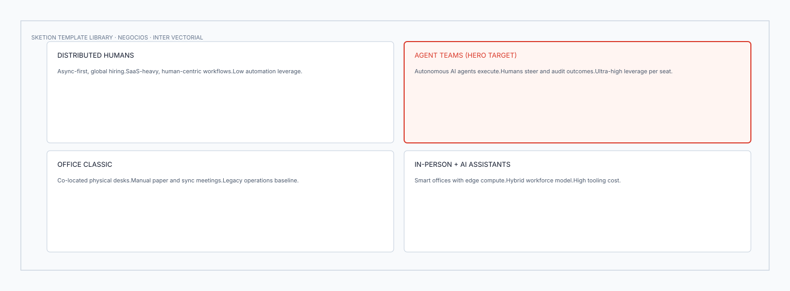
* [Descargar SVG](negocios/03_swot_foda.svg) · [Descargar Excalidraw](negocios/03_swot_foda.excalidraw)

---

### 12. Negocios: Product Roadmap (Now, Next, Later)
Línea temporal estratégica dividida en horizontes de entrega inmediata, mediano plazo y visión futura.
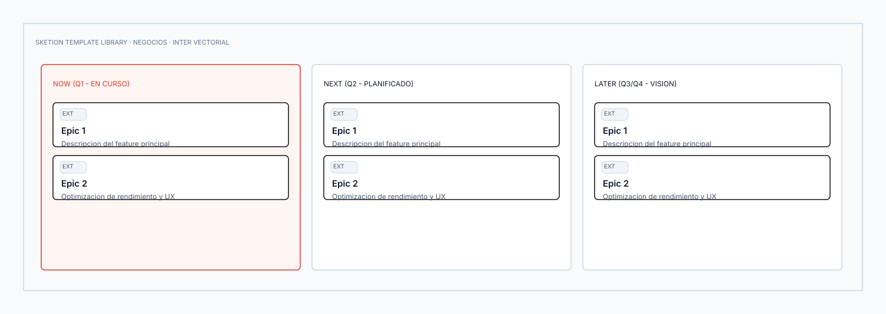
* [Descargar SVG](negocios/05_product_roadmap.svg) · [Descargar Excalidraw](negocios/05_product_roadmap.excalidraw)

---

### 13. Diseño & UX: Customer Journey Map
Mapeo transversal de etapas del cliente con acciones, puntos de contacto y curva emocional.
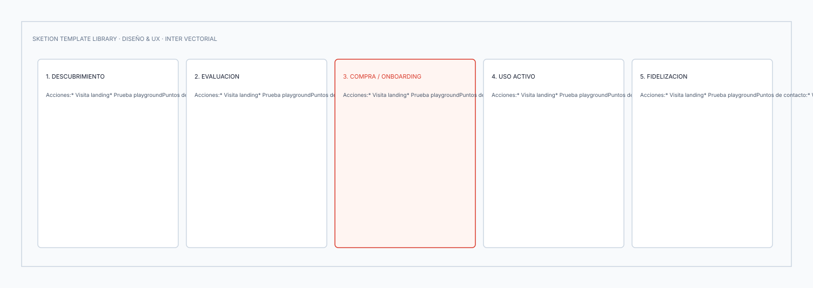
* [Descargar SVG](diseno_ux/01_customer_journey_map.svg) · [Descargar Excalidraw](diseno_ux/01_customer_journey_map.excalidraw)

---

### 14. Productividad: Kanban Workflow Board
Tablero de 4 carriles (Backlog, En Progreso, En Revisión, Completado) con tarjetas de tareas.
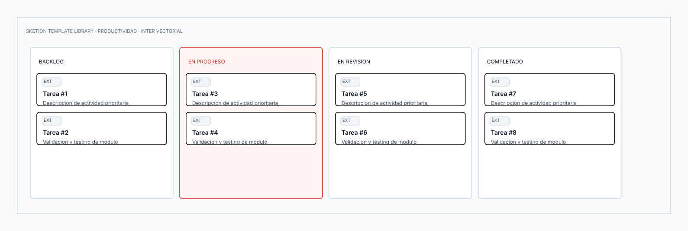
* [Descargar SVG](productividad/01_kanban_board.svg) · [Descargar Excalidraw](productividad/01_kanban_board.excalidraw)

---

### 15. Productividad: Agile Sprint Retrospective
Tablero ágil estructurado: ¿Qué funcionó bien?, ¿Qué podemos mejorar? y Acciones concretas.
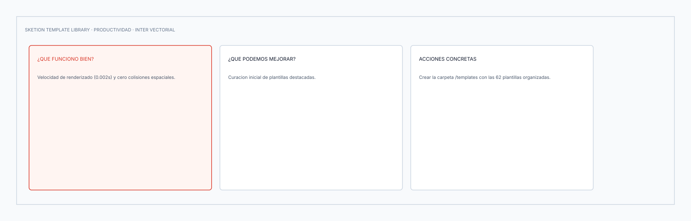
* [Descargar SVG](productividad/08_sprint_retrospective.svg) · [Descargar Excalidraw](productividad/08_sprint_retrospective.excalidraw)

---

## Índice Completo de las 62 Plantillas Curadas

### 1. Estudio (10 Plantillas)
| # | Plantilla | Archivos Disponibles | Propósito Académico |
| :-: | :--- | :--- | :--- |
| 1 | **Study Notes / Apuntes de Clase** (Destacada) | [SVG](estudio/01_study_notes.svg) · [Excalidraw](estudio/01_study_notes.excalidraw) | Síntesis estructurada con preguntas clave, notas y resumen. |
| 2 | **Mapa Mental** (Destacada) | [SVG](estudio/02_mind_map.svg) · [Excalidraw](estudio/02_mind_map.excalidraw) | Organización radial de conceptos alrededor de una idea central. |
| 3 | **Mapa Conceptual** | [SVG](estudio/03_concept_map.svg) · [Excalidraw](estudio/03_concept_map.excalidraw) | Nodos jerárquicos con proposiciones y conectores semánticos. |
| 4 | **Resumen de Lectura** | [SVG](estudio/04_reading_summary.svg) · [Excalidraw](estudio/04_reading_summary.excalidraw) | Ficha de lectura con tesis del autor, argumentos y conclusión. |
| 5 | **Preparación de Parcial** (Destacada) | [SVG](estudio/05_exam_prep.svg) · [Excalidraw](estudio/05_exam_prep.excalidraw) | Matriz de seguimiento por tema, dificultad y ejercicios clave. |
| 6 | **Flashcard Board** | [SVG](estudio/06_flashcard_board.svg) · [Excalidraw](estudio/06_flashcard_board.excalidraw) | Tablero de tarjetas de memorización activa (Active Recall). |
| 7 | **Research Canvas** | [SVG](estudio/07_research_canvas.svg) · [Excalidraw](estudio/07_research_canvas.excalidraw) | Pregunta de investigación, hipótesis, metodología y fuentes. |
| 8 | **Cornell Notes** | [SVG](estudio/08_cornell_notes.svg) · [Excalidraw](estudio/08_cornell_notes.excalidraw) | Sistema clásico de toma de apuntes Cornell. |
| 9 | **Lecture Review** | [SVG](estudio/09_lecture_review.svg) · [Excalidraw](estudio/09_lecture_review.excalidraw) | Retención post-clase: ideas principales, dudas y aplicación real. |
| 10 | **Learning Roadmap** | [SVG](estudio/10_learning_roadmap.svg) · [Excalidraw](estudio/10_learning_roadmap.excalidraw) | Ruta de aprendizaje escalonada por fases de dominio. |

---

### 2. Ingeniería (10 Plantillas)
| # | Plantilla | Archivos Disponibles | Propósito en Ingeniería |
| :-: | :--- | :--- | :--- |
| 1 | **SIPOC** (Destacada) | [SVG](ingenieria/01_sipoc.svg) · [Excalidraw](ingenieria/01_sipoc.excalidraw) | Análisis de alto nivel de flujo de valor (Suppliers, Inputs, Process, Outputs, Customers). |
| 2 | **Value Stream Mapping** (Destacada) | [SVG](ingenieria/02_value_stream_mapping.svg) · [Excalidraw](ingenieria/02_value_stream_mapping.excalidraw) | Mapeo de flujo de valor y medición de tiempos Lead Time / Cycle Time. |
| 3 | **Process Map** | [SVG](ingenieria/03_process_map.svg) · [Excalidraw](ingenieria/03_process_map.excalidraw) | Diagrama de flujo de operaciones con nodos de decisión. |
| 4 | **Fishbone / Ishikawa** (Destacada) | [SVG](ingenieria/04_fishbone_ishikawa.svg) · [Excalidraw](ingenieria/04_fishbone_ishikawa.excalidraw) | Diagnóstico de causa-efecto con las 6Ms de calidad industrial. |
| 5 | **FMEA** | [SVG](ingenieria/05_fmea.svg) · [Excalidraw](ingenieria/05_fmea.excalidraw) | Análisis de modos y efectos de fallos con cálculo de RPN. |
| 6 | **Pareto Analysis** | [SVG](ingenieria/06_pareto_analysis.svg) · [Excalidraw](ingenieria/06_pareto_analysis.excalidraw) | Gráfico 80/20 de causas críticas y porcentaje acumulado. |
| 7 | **Risk Matrix** | [SVG](ingenieria/07_risk_matrix.svg) · [Excalidraw](ingenieria/07_risk_matrix.excalidraw) | Matriz de evaluación de riesgos (Probabilidad vs Impacto). |
| 8 | **Capacity Planning** | [SVG](ingenieria/08_capacity_planning.svg) · [Excalidraw](ingenieria/08_capacity_planning.excalidraw) | Identificación de cuellos de botella y balanceo de líneas. |
| 9 | **Root Cause Analysis (5 Whys)** | [SVG](ingenieria/09_root_cause_analysis.svg) · [Excalidraw](ingenieria/09_root_cause_analysis.excalidraw) | Cadena causal secuencial de 5 porqués hasta la causa raíz. |
| 10 | **Continuous Improvement (PDCA)** | [SVG](ingenieria/10_continuous_improvement_kaizen.svg) · [Excalidraw](ingenieria/10_continuous_improvement_kaizen.excalidraw) | Ciclo de Deming / Kaizen (Plan, Do, Check, Act). |

---

### 3. Software & IA (12 Plantillas)
| # | Plantilla | Archivos Disponibles | Propósito en Arquitectura & IA |
| :-: | :--- | :--- | :--- |
| 1 | **System Design** (Destacada) | [SVG](software_ia/01_system_design.svg) · [Excalidraw](software_ia/01_system_design.excalidraw) | Diseño de sistemas escalables (DNS, LB, Microservicios, Cache, BD). |
| 2 | **Software Architecture** | [SVG](software_ia/02_software_architecture.svg) · [Excalidraw](software_ia/02_software_architecture.excalidraw) | Arquitectura multicapa en VPC con fronteras de seguridad. |
| 3 | **API Architecture** | [SVG](software_ia/03_api_architecture.svg) · [Excalidraw](software_ia/03_api_architecture.excalidraw) | API Gateway, enrutamiento, rate limiting y microservicios. |
| 4 | **Database Schema** (Destacada) | [SVG](software_ia/04_database_schema.svg) · [Excalidraw](software_ia/04_database_schema.excalidraw) | Esquema relacional con tablas, claves PK/FK y tipos. |
| 5 | **Microservices Architecture** | [SVG](software_ia/05_microservices_architecture.svg) · [Excalidraw](software_ia/05_microservices_architecture.excalidraw) | Clúster de servicios desacoplados con contratos de comunicación. |
| 6 | **Event-Driven Architecture** | [SVG](software_ia/06_event_driven_architecture.svg) · [Excalidraw](software_ia/06_event_driven_architecture.excalidraw) | Bus de eventos Apache Kafka con productores y workers consumidores. |
| 7 | **User Flow** | [SVG](software_ia/07_user_flow.svg) · [Excalidraw](software_ia/07_user_flow.excalidraw) | Flujo lógico de interacción del sistema y ramas condicionales. |
| 8 | **Sequence Diagram** | [SVG](software_ia/08_sequence_diagram.svg) · [Excalidraw](software_ia/08_sequence_diagram.excalidraw) | Mensajes sincrónicos y asíncronos en el tiempo sobre lifelines. |
| 9 | **AI Agent Architecture** (Destacada) | [SVG](software_ia/09_ai_agent_architecture.svg) · [Excalidraw](software_ia/09_ai_agent_architecture.excalidraw) | Agente autónomo con memoria episódica, LLM Brain y Tool Calling. |
| 10 | **RAG Architecture** | [SVG](software_ia/10_rag_architecture.svg) · [Excalidraw](software_ia/10_rag_architecture.excalidraw) | Pipeline RAG: Ingestión, Embeddings, Vector DB y Grounded LLM. |
| 11 | **AI Workflow (Human-in-the-Loop)** | [SVG](software_ia/11_ai_workflow.svg) · [Excalidraw](software_ia/11_ai_workflow.excalidraw) | Flujo con carriles de automatización y supervisión humana. |
| 12 | **Prompt Engineering Framework** | [SVG](software_ia/12_prompt_engineering_framework.svg) · [Excalidraw](software_ia/12_prompt_engineering_framework.excalidraw) | Marco estructurado para diseño de prompts empresariales. |

---

### 4. Negocios & Producto (10 Plantillas)
| # | Plantilla | Archivos Disponibles | Propósito Estratégico |
| :-: | :--- | :--- | :--- |
| 1 | **Business Model Canvas** | [SVG](negocios/01_business_model_canvas.svg) · [Excalidraw](negocios/01_business_model_canvas.excalidraw) | Los 9 bloques tradicionales de Osterwalder. |
| 2 | **Lean Canvas** (Destacada) | [SVG](negocios/02_lean_canvas.svg) · [Excalidraw](negocios/02_lean_canvas.excalidraw) | Framework de Ash Maurya enfocado en validación de startups. |
| 3 | **SWOT / FODA** (Destacada) | [SVG](negocios/03_swot_foda.svg) · [Excalidraw](negocios/03_swot_foda.excalidraw) | Matriz 2x2 de factores internos y externos. |
| 4 | **Product Vision Board** | [SVG](negocios/04_product_vision_board.svg) · [Excalidraw](negocios/04_product_vision_board.excalidraw) | Alineación de visión, público objetivo, necesidades y valor. |
| 5 | **Product Roadmap** (Destacada) | [SVG](negocios/05_product_roadmap.svg) · [Excalidraw](negocios/05_product_roadmap.excalidraw) | Horizontes de producto Now, Next, Later con epics clave. |
| 6 | **OKR Planner** | [SVG](negocios/06_okr_planner.svg) · [Excalidraw](negocios/06_okr_planner.excalidraw) | Objetivos estratégicos y resultados clave cuantitativos. |
| 7 | **Decision Matrix** | [SVG](negocios/07_decision_matrix.svg) · [Excalidraw](negocios/07_decision_matrix.excalidraw) | Ponderación multicriterio para toma de decisiones tecnológicas. |
| 8 | **Eisenhower Matrix** | [SVG](negocios/08_eisenhower_matrix.svg) · [Excalidraw](negocios/08_eisenhower_matrix.excalidraw) | Matriz de urgencia vs importancia. |
| 9 | **Stakeholder Map** | [SVG](negocios/09_stakeholder_map.svg) · [Excalidraw](negocios/09_stakeholder_map.excalidraw) | Mapeo de interesados por nivel de poder e interés. |
| 10 | **Go-To-Market (GTM) Plan** | [SVG](negocios/10_go_to_market_plan.svg) · [Excalidraw](negocios/10_go_to_market_plan.excalidraw) | Fases secuenciales de lanzamiento y penetración de mercado. |

---

### 5. Diseño & UX (10 Plantillas)
| # | Plantilla | Archivos Disponibles | Propósito en Diseño de Experiencia |
| :-: | :--- | :--- | :--- |
| 1 | **Customer Journey Map** (Destacada) | [SVG](diseno_ux/01_customer_journey_map.svg) · [Excalidraw](diseno_ux/01_customer_journey_map.excalidraw) | Trayectoria del cliente, puntos de contacto y oportunidades. |
| 2 | **User Journey Map** | [SVG](diseno_ux/02_user_journey_map.svg) · [Excalidraw](diseno_ux/02_user_journey_map.excalidraw) | Mapeo de interacción paso a paso para un flujo específico. |
| 3 | **Empathy Map** | [SVG](diseno_ux/03_empathy_map.svg) · [Excalidraw](diseno_ux/03_empathy_map.excalidraw) | Cuadrantes de empatía: qué dice, piensa, hace y siente el usuario. |
| 4 | **Persona Canvas** | [SVG](diseno_ux/04_persona_canvas.svg) · [Excalidraw](diseno_ux/04_persona_canvas.excalidraw) | Arquetipo de usuario con metas, dolores y herramientas. |
| 5 | **User Flow** | [SVG](diseno_ux/05_user_flow.svg) · [Excalidraw](diseno_ux/05_user_flow.excalidraw) | Diagrama de flujo de pantallas y bifurcaciones de UX. |
| 6 | **Wireframe Board** | [SVG](diseno_ux/06_wireframe_board.svg) · [Excalidraw](diseno_ux/06_wireframe_board.excalidraw) | Estructuras de baja fidelidad para maquetación rápida. |
| 7 | **Design Critique** | [SVG](diseno_ux/07_design_critique.svg) · [Excalidraw](diseno_ux/07_design_critique.excalidraw) | Sesión de feedback: aspectos positivos, dudas y mejoras. |
| 8 | **UX Research Board** | [SVG](diseno_ux/08_ux_research_board.svg) · [Excalidraw](diseno_ux/08_ux_research_board.excalidraw) | Consolidación de hallazgos, insights y citas de usuarios. |
| 9 | **Heuristic Evaluation** | [SVG](diseno_ux/09_heuristic_evaluation.svg) · [Excalidraw](diseno_ux/09_heuristic_evaluation.excalidraw) | Evaluación de las 10 heurísticas de usabilidad de Nielsen. |
| 10 | **Design Sprint** | [SVG](diseno_ux/10_design_sprint.svg) · [Excalidraw](diseno_ux/10_design_sprint.excalidraw) | Tablero de 5 días de Google Design Sprint. |

---

### 6. Productividad (10 Plantillas)
| # | Plantilla | Archivos Disponibles | Propósito en Gestión Personal & Equipos |
| :-: | :--- | :--- | :--- |
| 1 | **Kanban Board** (Destacada) | [SVG](productividad/01_kanban_board.svg) · [Excalidraw](productividad/01_kanban_board.excalidraw) | Gestión visual de flujo de trabajo con 4 columnas. |
| 2 | **Weekly Planner** | [SVG](productividad/02_weekly_planner.svg) · [Excalidraw](productividad/02_weekly_planner.excalidraw) | Planificación semanal de Lunes a Viernes con prioridades. |
| 3 | **Daily Planner** | [SVG](productividad/03_daily_planner.svg) · [Excalidraw](productividad/03_daily_planner.excalidraw) | Enfoque diario: Top 3 prioridades, timeblocking y notas. |
| 4 | **Time Blocking** | [SVG](productividad/04_time_blocking.svg) · [Excalidraw](productividad/04_time_blocking.excalidraw) | Bloques temporales para Deep Work, reuniones y administración. |
| 5 | **Habit Tracker** | [SVG](productividad/05_habit_tracker.svg) · [Excalidraw](productividad/05_habit_tracker.excalidraw) | Matriz mensual de seguimiento de hábitos y constancia. |
| 6 | **Meeting Notes** | [SVG](productividad/06_meeting_notes.svg) · [Excalidraw](productividad/06_meeting_notes.excalidraw) | Registro de reuniones: objetivo, acuerdos y responsables. |
| 7 | **Action Items** | [SVG](productividad/07_action_items.svg) · [Excalidraw](productividad/07_action_items.excalidraw) | Matriz de seguimiento de tareas con deadlines y estado. |
| 8 | **Sprint Retrospective** (Destacada) | [SVG](productividad/08_sprint_retrospective.svg) · [Excalidraw](productividad/08_sprint_retrospective.excalidraw) | Dinámica de retrospectiva ágil para equipos de desarrollo. |
| 9 | **Team Alignment** | [SVG](productividad/09_team_alignment.svg) · [Excalidraw](productividad/09_team_alignment.excalidraw) | Canvas de acuerdos, roles y misión compartida de equipo. |
| 10 | **Priority Matrix** | [SVG](productividad/10_priority_matrix.svg) · [Excalidraw](productividad/10_priority_matrix.excalidraw) | Matriz de impacto vs esfuerzo para priorización de backlog. |

---

## Cómo Generar o Regenerar la Biblioteca Completa

Puedes ejecutar el script de generación batch en cualquier momento para reconstruir las 62 plantillas:

```bash
python3 templates/generate_templates.py
```
