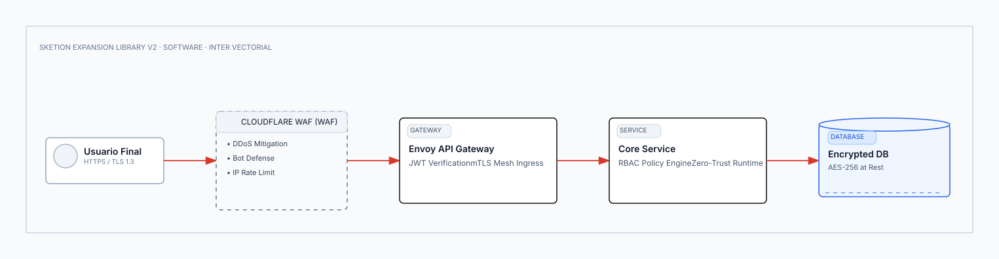
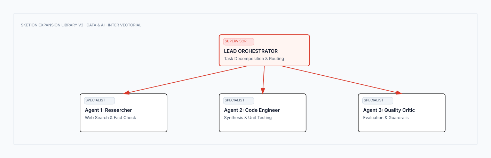
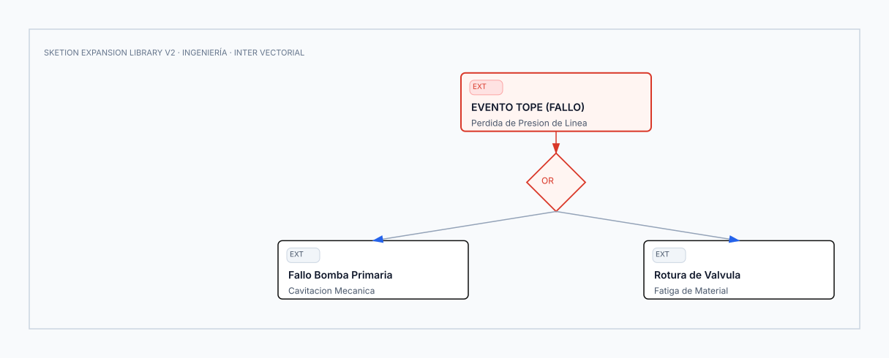
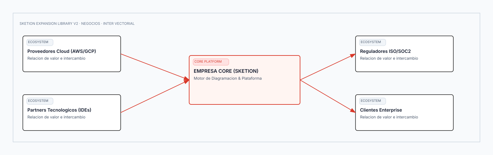

<div align="center">


# Sketion Expansion Library v2 (`/templates_2`)

**150 Plantillas Vectoriales Especializadas de Arquitectura, Ingeniería y Estrategia**  
*Complemento de alta especialización técnica para el núcleo de 62 plantillas (`/templates`)*  
**Ecosistema Total: 212 Plantillas Vectoriales Puras (VCS: 99.50 / 100 · 0 Emojis)**

</div>

---

## Taxonomía y Benchmark Estructural

La biblioteca `templates_2` funciona simultáneamente como **catálogo de recursos listos para producción** y como **banco de pruebas estructural (Benchmark)** del motor Sketion.

Cada plantilla incluye metadata estructurada en [**`template_manifest.json`**](template_manifest.json) con clasificación de dificultad:

* **Baja Complejidad (7):** Canvas libres, notas estructuradas y timeboxes individuales.
* **Media Complejidad (75):** Matrices 2x2, jerarquías de árbol, flujos horizontales y carriles.
* **Alta Complejidad (60):** Modelos UML, pipelines ETL, diagramas de Venn, grafos de dependencias y Service Blueprints.
* **Extrema Complejidad (8):** Arquitecturas Zero-Trust, Clústeres Kubernetes, AWS/Azure/GCP Multi-AZ, Sistemas Multi-Agente y Flujos OAuth 2.0 PKCE.

---

## Muestrario de Alta Complejidad (Generated Showcase)

### 1. Software: Arquitectura de Seguridad Zero-Trust (`50_security_architecture`)
*Perímetro defensivo multicapa: Usuario $\rightarrow$ WAF $\rightarrow$ Envoy API Gateway mTLS $\rightarrow$ Core RBAC $\rightarrow$ BD Cifrada.*

* [Descargar SVG](03_software_architecture/50_security_architecture.svg) · [Descargar Excalidraw](03_software_architecture/50_security_architecture.excalidraw)

---

### 2. Data & AI: Sistema Multi-Agente Autónomo (`72_multi_agent_system`)
*Orquestador supervisor con delegación a agentes especialistas (Investigador, Programador, Crítico).*

* [Descargar SVG](04_data_apis_ai/72_multi_agent_system.svg) · [Descargar Excalidraw](04_data_apis_ai/72_multi_agent_system.excalidraw)

---

### 3. Ingeniería: Fault Tree Analysis con Compuertas Lógicas (`36_failure_tree_analysis_fta`)
*Árbol de fallos con compuertas booleanas AND / OR y eventos raíz.*

* [Descargar SVG](02_ingenieria_procesos/36_failure_tree_analysis_fta.svg) · [Descargar Excalidraw](02_ingenieria_procesos/36_failure_tree_analysis_fta.excalidraw)

---

### 4. Negocios: Ecosistema Empresarial y Red de Valor (`86_business_ecosystem_map`)
*Red multiactor: Proveedores, Partners, Reguladores, Clientes y Plataforma Tecnológica.*

* [Descargar SVG](05_negocios_estrategia/86_business_ecosystem_map.svg) · [Descargar Excalidraw](05_negocios_estrategia/86_business_ecosystem_map.excalidraw)

---

## Índice Completo de las 150 Nuevas Plantillas

### 01 — Estudio y Educación (20 Plantillas)
| # | Slug / Nombre | Complejidad | Archivos | Propósito Académico |
| :-: | :--- | :-: | :--- | :--- |
| 1 | **Study Planner** | Medium | [SVG](01_estudio_educacion/01_study_planner.svg) · [Excalidraw](01_estudio_educacion/01_study_planner.excalidraw) | Planificación semanal con timeboxing por materia. |
| 2 | **Subject Dashboard** | Low | [SVG](01_estudio_educacion/02_subject_dashboard.svg) · [Excalidraw](01_estudio_educacion/02_subject_dashboard.excalidraw) | Panel de control de notas, syllabus y entregas. |
| 3 | **Course Map** | Medium | [SVG](01_estudio_educacion/03_course_map.svg) · [Excalidraw](01_estudio_educacion/03_course_map.excalidraw) | Mapeo secuencial de módulos y semanas de clase. |
| 4 | **Chapter Summary** | Low | [SVG](01_estudio_educacion/04_chapter_summary.svg) · [Excalidraw](01_estudio_educacion/04_chapter_summary.excalidraw) | Síntesis de conceptos clave, fórmulas y preguntas. |
| 5 | **Book Analysis** | Medium | [SVG](01_estudio_educacion/05_book_analysis.svg) · [Excalidraw](01_estudio_educacion/05_book_analysis.excalidraw) | Ficha crítica de análisis de literatura técnica. |
| 6 | **Article Analysis** | Medium | [SVG](01_estudio_educacion/06_article_analysis.svg) · [Excalidraw](01_estudio_educacion/06_article_analysis.excalidraw) | Desglose metodológico de papers científicos. |
| 7 | **Thesis Statement Builder** | Medium | [SVG](01_estudio_educacion/07_thesis_statement_builder.svg) · [Excalidraw](01_estudio_educacion/07_thesis_statement_builder.excalidraw) | Formulación progresiva de postura y evidencias. |
| 8 | **Argument Map** | Medium | [SVG](01_estudio_educacion/08_argument_map.svg) · [Excalidraw](01_estudio_educacion/08_argument_map.excalidraw) | Árbol de premisas que sustentan la conclusión. |
| 9 | **Debate Map** | Medium | [SVG](01_estudio_educacion/09_debate_map.svg) · [Excalidraw](01_estudio_educacion/09_debate_map.excalidraw) | Cuadrantes de posturas a favor y en contra. |
| 10 | **Comparison Study** | High | [SVG](01_estudio_educacion/10_comparison_study.svg) · [Excalidraw](01_estudio_educacion/10_comparison_study.excalidraw) | Diagrama de Venn de comparación conceptual. |
| 11 | **Timeline Study** | Medium | [SVG](01_estudio_educacion/11_timeline_study.svg) · [Excalidraw](01_estudio_educacion/11_timeline_study.excalidraw) | Eje cronológico de evolución de teorías o hitos. |
| 12 | **Formula Sheet** | Medium | [SVG](01_estudio_educacion/12_formula_sheet.svg) · [Excalidraw](01_estudio_educacion/12_formula_sheet.excalidraw) | Hoja de referencia de teoremas y propiedades. |
| 13 | **Problem Solving Board** | Medium | [SVG](01_estudio_educacion/13_problem_solving_board.svg) · [Excalidraw](01_estudio_educacion/13_problem_solving_board.excalidraw) | 5 etapas de resolución analítica de problemas. |
| 14 | **Question Bank** | Medium | [SVG](01_estudio_educacion/14_question_bank.svg) · [Excalidraw](01_estudio_educacion/14_question_bank.excalidraw) | Banco estratificado de preguntas de examen. |
| 15 | **Exam Question Matrix** | High | [SVG](01_estudio_educacion/15_exam_question_matrix.svg) · [Excalidraw](01_estudio_educacion/15_exam_question_matrix.excalidraw) | Matriz de preguntas por tema y nivel taxonómico. |
| 16 | **Spaced Repetition Board** | Medium | [SVG](01_estudio_educacion/16_spaced_repetition_board.svg) · [Excalidraw](01_estudio_educacion/16_spaced_repetition_board.excalidraw) | 5 cajas Leitner de repaso por intervalos. |
| 17 | **Learning Progress Tracker** | High | [SVG](01_estudio_educacion/17_learning_progress_tracker.svg) · [Excalidraw](01_estudio_educacion/17_learning_progress_tracker.excalidraw) | Gráfico radar de dominio por competencias. |
| 18 | **Concept Dependency Map** | High | [SVG](01_estudio_educacion/18_concept_dependency_map.svg) · [Excalidraw](01_estudio_educacion/18_concept_dependency_map.excalidraw) | Grafo de dependencias y prerrequisitos. |
| 19 | **Lab Report Canvas** | Medium | [SVG](01_estudio_educacion/19_lab_report_canvas.svg) · [Excalidraw](01_estudio_educacion/19_lab_report_canvas.excalidraw) | Ficha estándar de reporte de laboratorio. |
| 20 | **Academic Project Canvas** | Medium | [SVG](01_estudio_educacion/20_academic_project_canvas.svg) · [Excalidraw](01_estudio_educacion/20_academic_project_canvas.excalidraw) | Canvas de formulación de tesis y capstone. |

---

### 02 — Ingeniería Industrial y Procesos (20 Plantillas)
| # | Slug / Nombre | Complejidad | Archivos | Propósito en Ingeniería |
| :-: | :--- | :-: | :--- | :--- |
| 21 | **Value Added Flow Analysis** | High | [SVG](02_ingenieria_procesos/21_value_added_flow_analysis.svg) · [Excalidraw](02_ingenieria_procesos/21_value_added_flow_analysis.excalidraw) | Desglose de actividades VA, NNVA y NVA. |
| 22 | **Swimlane Process Map** | High | [SVG](02_ingenieria_procesos/22_swimlane_process_map.svg) · [Excalidraw](02_ingenieria_procesos/22_swimlane_process_map.excalidraw) | Carriles de proceso interdepartamentales. |
| 23 | **Decision Analysis Tree** | High | [SVG](02_ingenieria_procesos/23_decision_analysis_tree.svg) · [Excalidraw](02_ingenieria_procesos/23_decision_analysis_tree.excalidraw) | Árbol de decisiones con payoffs y riesgos. |
| 24 | **Process Analysis Matrix** | Medium | [SVG](02_ingenieria_procesos/24_process_analysis_matrix.svg) · [Excalidraw](02_ingenieria_procesos/24_process_analysis_matrix.excalidraw) | Matriz de parámetros y variables operativas. |
| 25 | **Spaghetti Diagram** | High | [SVG](02_ingenieria_procesos/25_spaghetti_diagram.svg) · [Excalidraw](02_ingenieria_procesos/25_spaghetti_diagram.excalidraw) | Mapeo físico de trayectorias y transporte. |
| 26 | **Takt Time Analysis** | Medium | [SVG](02_ingenieria_procesos/26_takt_time_analysis.svg) | [Excalidraw](02_ingenieria_procesos/26_takt_time_analysis.excalidraw) | Comparación de tiempos de ciclo vs demanda cliente. |
| 27 | **Cycle Time Analysis** | High | [SVG](02_ingenieria_procesos/27_cycle_time_analysis.svg) · [Excalidraw](02_ingenieria_procesos/27_cycle_time_analysis.excalidraw) | Variabilidad y distribución de tiempos de estación. |
| 28 | **Line Balancing** | High | [SVG](02_ingenieria_procesos/28_line_balancing.svg) · [Excalidraw](02_ingenieria_procesos/28_line_balancing.excalidraw) | Balanceo de carga y minimización de cuellos. |
| 29 | **Bottleneck Analysis** | Medium | [SVG](02_ingenieria_procesos/29_bottleneck_analysis.svg) · [Excalidraw](02_ingenieria_procesos/29_bottleneck_analysis.excalidraw) | Teoría de restricciones y estación limitante. |
| 30 | **OEE Dashboard** | Medium | [SVG](02_ingenieria_procesos/30_oee_dashboard.svg) · [Excalidraw](02_ingenieria_procesos/30_oee_dashboard.excalidraw) | Disponibilidad $\times$ Rendimiento $\times$ Calidad. |
| 31 | **Quality Control Plan** | Medium | [SVG](02_ingenieria_procesos/31_quality_control_plan.svg) · [Excalidraw](02_ingenieria_procesos/31_quality_control_plan.excalidraw) | Plan de control de puntos críticos (QCP). |
| 32 | **Control Chart** | High | [SVG](02_ingenieria_procesos/32_control_chart.svg) · [Excalidraw](02_ingenieria_procesos/32_control_chart.excalidraw) | Gráficos SPC con límites LCS, Media y LCI. |
| 33 | **Histogram Analysis** | Medium | [SVG](02_ingenieria_procesos/33_histogram_analysis.svg) · [Excalidraw](02_ingenieria_procesos/33_histogram_analysis.excalidraw) | Distribución de frecuencias de medidas de pieza. |
| 34 | **Scatter Diagram** | Medium | [SVG](02_ingenieria_procesos/34_scatter_diagram.svg) · [Excalidraw](02_ingenieria_procesos/34_scatter_diagram.excalidraw) | Correlación causa-efecto entre dos variables. |
| 35 | **Process Capability** | Medium | [SVG](02_ingenieria_procesos/35_process_capability.svg) · [Excalidraw](02_ingenieria_procesos/35_process_capability.excalidraw) | Índices estadísticos $Cp$ y $Cpk$. |
| 36 | **Failure Tree Analysis (FTA)** | High | [SVG](02_ingenieria_procesos/36_failure_tree_analysis_fta.svg) · [Excalidraw](02_ingenieria_procesos/36_failure_tree_analysis_fta.excalidraw) | Árbol lógico de fallos con compuertas AND/OR. |
| 37 | **8D Problem Solving** | Medium | [SVG](02_ingenieria_procesos/37_8d_problem_solving.svg) · [Excalidraw](02_ingenieria_procesos/37_8d_problem_solving.excalidraw) | Las 8 disciplinas de resolución industrial. |
| 38 | **A3 Problem Solving** | Medium | [SVG](02_ingenieria_procesos/38_a3_problem_solving.svg) · [Excalidraw](02_ingenieria_procesos/38_a3_problem_solving.excalidraw) | Informe ejecutivo A3 en ciclo PDCA. |
| 39 | **Kaizen Board** | Medium | [SVG](02_ingenieria_procesos/39_kaizen_board.svg) · [Excalidraw](02_ingenieria_procesos/39_kaizen_board.excalidraw) | Tablero de mejoras continuas en planta. |
| 40 | **Standard Work Combination** | High | [SVG](02_ingenieria_procesos/40_standard_work_combination.svg) · [Excalidraw](02_ingenieria_procesos/40_standard_work_combination.excalidraw) | Coordinación de trabajo manual y automático. |

---

### 03 — Software Architecture (20 Plantillas)
| # | Slug / Nombre | Complejidad | Archivos | Propósito en Arquitectura |
| :-: | :--- | :-: | :--- | :--- |
| 41 | **C4 System Context** | High | [SVG](03_software_architecture/41_c4_system_context.svg) · [Excalidraw](03_software_architecture/41_c4_system_context.excalidraw) | C4 Nivel 1: Contexto de usuarios y límites. |
| 42 | **C4 Container Diagram** | High | [SVG](03_software_architecture/42_c4_container_diagram.svg) · [Excalidraw](03_software_architecture/42_c4_container_diagram.excalidraw) | C4 Nivel 2: Apps, DBs y protocolos. |
| 43 | **C4 Component Diagram** | High | [SVG](03_software_architecture/43_c4_component_diagram.svg) · [Excalidraw](03_software_architecture/43_c4_component_diagram.excalidraw) | C4 Nivel 3: Controladores y repositorios. |
| 44 | **Deployment Diagram** | High | [SVG](03_software_architecture/44_deployment_diagram.svg) · [Excalidraw](03_software_architecture/44_deployment_diagram.excalidraw) | Nodos físicos, servidores y redes. |
| 45 | **Component Architecture** | High | [SVG](03_software_architecture/45_component_architecture.svg) · [Excalidraw](03_software_architecture/45_component_architecture.excalidraw) | Puertos, adaptadores y contratos de interfaz. |
| 46 | **Class Diagram** | High | [SVG](03_software_architecture/46_class_diagram.svg) · [Excalidraw](03_software_architecture/46_class_diagram.excalidraw) | Clases UML con métodos y cardinalidad. |
| 47 | **Activity Diagram** | Medium | [SVG](03_software_architecture/47_activity_diagram.svg) · [Excalidraw](03_software_architecture/47_activity_diagram.excalidraw) | Concurrencia, Forks y Joins UML. |
| 48 | **State Machine Diagram** | High | [SVG](03_software_architecture/48_state_machine_diagram.svg) · [Excalidraw](03_software_architecture/48_state_machine_diagram.excalidraw) | Estados finitos, eventos y transiciones. |
| 49 | **Use Case Diagram** | Medium | [SVG](03_software_architecture/49_use_case_diagram.svg) · [Excalidraw](03_software_architecture/49_use_case_diagram.excalidraw) | Casos de uso con include y extend. |
| 50 | **Security Architecture** | Extreme | [SVG](03_software_architecture/50_security_architecture.svg) · [Excalidraw](03_software_architecture/50_security_architecture.excalidraw) | Perímetro Zero-Trust (WAF $\rightarrow$ Gateway $\rightarrow$ DB). |
| 51 | **Network Architecture** | High | [SVG](03_software_architecture/51_network_architecture.svg) · [Excalidraw](03_software_architecture/51_network_architecture.excalidraw) | DMZ, subredes públicas/privadas y firewall. |
| 52 | **Package Diagram** | Medium | [SVG](03_software_architecture/52_package_diagram.svg) · [Excalidraw](03_software_architecture/52_package_diagram.excalidraw) | Modularidad y dependencias entre paquetes. |
| 53 | **Infrastructure Architecture** | High | [SVG](03_software_architecture/53_infrastructure_architecture.svg) · [Excalidraw](03_software_architecture/53_infrastructure_architecture.excalidraw) | Servidores híbridos y centros de datos. |
| 54 | **Cloud Architecture** | High | [SVG](03_software_architecture/54_cloud_architecture.svg) · [Excalidraw](03_software_architecture/54_cloud_architecture.excalidraw) | Arquitectura multi-zona de alta disponibilidad. |
| 55 | **AWS Architecture** | Extreme | [SVG](03_software_architecture/55_aws_architecture.svg) · [Excalidraw](03_software_architecture/55_aws_architecture.excalidraw) | ALB, ECS Fargate, Aurora RDS, S3 y CloudFront. |
| 56 | **Azure Architecture** | Extreme | [SVG](03_software_architecture/56_azure_architecture.svg) · [Excalidraw](03_software_architecture/56_azure_architecture.excalidraw) | App Gateway, AKS Cluster, Cosmos DB. |
| 57 | **GCP Architecture** | Extreme | [SVG](03_software_architecture/57_gcp_architecture.svg) · [Excalidraw](03_software_architecture/57_gcp_architecture.excalidraw) | Cloud Armor, GKE, Cloud Spanner, Pub/Sub. |
| 58 | **CI/CD Pipeline** | High | [SVG](03_software_architecture/58_cicd_pipeline.svg) · [Excalidraw](03_software_architecture/58_cicd_pipeline.excalidraw) | Pipeline de despliegue continuo con security gate. |
| 59 | **Kubernetes Architecture** | Extreme | [SVG](03_software_architecture/59_kubernetes_architecture.svg) · [Excalidraw](03_software_architecture/59_kubernetes_architecture.excalidraw) | Control Plane, Nodos Worker, Pods e Ingress. |
| 60 | **Docker Architecture** | Medium | [SVG](03_software_architecture/60_docker_architecture.svg) · [Excalidraw](03_software_architecture/60_docker_architecture.excalidraw) | Daemon, contenedores y redes puente. |

---

### 04 — Data, APIs & AI (15 Plantillas)
| # | Slug / Nombre | Complejidad | Archivos | Propósito en Datos & IA |
| :-: | :--- | :-: | :--- | :--- |
| 61 | **DFD Level 0** | Medium | [SVG](04_data_apis_ai/61_dfd_level_0.svg) · [Excalidraw](04_data_apis_ai/61_dfd_level_0.excalidraw) | Diagrama de flujo de datos de contexto. |
| 62 | **DFD Level 1** | High | [SVG](04_data_apis_ai/62_dfd_level_1.svg) · [Excalidraw](04_data_apis_ai/62_dfd_level_1.excalidraw) | Descomposición de procesos y almacenes. |
| 63 | **Data Pipeline Architecture** | High | [SVG](04_data_apis_ai/63_data_pipeline_architecture.svg) · [Excalidraw](04_data_apis_ai/63_data_pipeline_architecture.excalidraw) | Pipeline híbrido Streaming y Batch. |
| 64 | **Data Warehouse Architecture** | High | [SVG](04_data_apis_ai/64_data_warehouse_architecture.svg) · [Excalidraw](04_data_apis_ai/64_data_warehouse_architecture.excalidraw) | DWH con Staging, Star Schema y Data Marts. |
| 65 | **Data Lake Architecture** | High | [SVG](04_data_apis_ai/65_data_lake_architecture.svg) · [Excalidraw](04_data_apis_ai/65_data_lake_architecture.excalidraw) | Lakehouse multicapa (Raw, Bronze, Silver, Gold). |
| 66 | **ETL Pipeline** | Medium | [SVG](04_data_apis_ai/66_etl_pipeline.svg) · [Excalidraw](04_data_apis_ai/66_etl_pipeline.excalidraw) | Extracción, transformación y carga con gates. |
| 67 | **API Request Flow** | High | [SVG](04_data_apis_ai/67_api_request_flow.svg) · [Excalidraw](04_data_apis_ai/67_api_request_flow.excalidraw) | Ciclo de vida HTTP de petición a respuesta. |
| 68 | **API Integration Map** | High | [SVG](04_data_apis_ai/68_api_integration_map.svg) · [Excalidraw](04_data_apis_ai/68_api_integration_map.excalidraw) | Contratos con APIs de terceros y pasarelas. |
| 69 | **Webhook Architecture** | High | [SVG](04_data_apis_ai/69_webhook_architecture.svg) · [Excalidraw](04_data_apis_ai/69_webhook_architecture.excalidraw) | Webhooks con verificación HMAC y DLQ. |
| 70 | **OAuth Auth Flow** | Extreme | [SVG](04_data_apis_ai/70_oauth_authentication_flow.svg) · [Excalidraw](04_data_apis_ai/70_oauth_authentication_flow.excalidraw) | Authorization Code Flow con PKCE. |
| 71 | **JWT Auth Flow** | Medium | [SVG](04_data_apis_ai/71_jwt_authentication_flow.svg) · [Excalidraw](04_data_apis_ai/71_jwt_authentication_flow.excalidraw) | Emisión, firma asimétrica y refresco de tokens. |
| 72 | **Multi-Agent System** | Extreme | [SVG](04_data_apis_ai/72_multi_agent_system.svg) · [Excalidraw](04_data_apis_ai/72_multi_agent_system.excalidraw) | Sistema multi-agente con orquestador supervisor. |
| 73 | **LLM App Architecture** | High | [SVG](04_data_apis_ai/73_llm_app_architecture.svg) · [Excalidraw](04_data_apis_ai/73_llm_app_architecture.excalidraw) | Caché semántica, guardrails y fallback. |
| 74 | **Vector DB Architecture** | High | [SVG](04_data_apis_ai/74_vector_db_architecture.svg) · [Excalidraw](04_data_apis_ai/74_vector_db_architecture.excalidraw) | Indexación HNSW y cuantización vectorial. |
| 75 | **AI Evaluation Pipeline** | High | [SVG](04_data_apis_ai/75_ai_evaluation_pipeline.svg) · [Excalidraw](04_data_apis_ai/75_ai_evaluation_pipeline.excalidraw) | Evaluación de fidelidad, groundedness y evals. |

---

### 05 — Negocios y Estrategia (15 Plantillas)
| # | Slug / Nombre | Complejidad | Archivos | Propósito Estratégico |
| :-: | :--- | :-: | :--- | :--- |
| 76 | **PESTEL Analysis** | Medium | [SVG](05_negocios_estrategia/76_pestel_analysis.svg) · [Excalidraw](05_negocios_estrategia/76_pestel_analysis.excalidraw) | 6 factores del entorno macroeconómico. |
| 77 | **Porter's Five Forces** | High | [SVG](05_negocios_estrategia/77_porters_five_forces.svg) · [Excalidraw](05_negocios_estrategia/77_porters_five_forces.excalidraw) | Las 5 fuerzas de rivalidad y poder industrial. |
| 78 | **BCG Matrix** | Medium | [SVG](05_negocios_estrategia/78_bcg_matrix.svg) · [Excalidraw](05_negocios_estrategia/78_bcg_matrix.excalidraw) | Cartera de productos (Estrellas, Vacas, etc.). |
| 79 | **Ansoff Matrix** | Medium | [SVG](05_negocios_estrategia/79_ansoff_matrix.svg) · [Excalidraw](05_negocios_estrategia/79_ansoff_matrix.excalidraw) | Estrategias de penetración y diversificación. |
| 80 | **Value Proposition Canvas** | Medium | [SVG](05_negocios_estrategia/80_value_proposition_canvas.svg) · [Excalidraw](05_negocios_estrategia/80_value_proposition_canvas.excalidraw) | Encaje entre mapa de valor y perfil cliente. |
| 81 | **Business Strategy Map** | High | [SVG](05_negocios_estrategia/81_business_strategy_map.svg) · [Excalidraw](05_negocios_estrategia/81_business_strategy_map.excalidraw) | Balanced Scorecard en 4 perspectivas. |
| 82 | **Strategic Objectives Map** | Medium | [SVG](05_negocios_estrategia/82_strategic_objectives_map.svg) · [Excalidraw](05_negocios_estrategia/82_strategic_objectives_map.excalidraw) | Árbol de alineación de metas corporativas. |
| 83 | **Strategy to Execution Map** | High | [SVG](05_negocios_estrategia/83_strategy_to_execution_map.svg) · [Excalidraw](05_negocios_estrategia/83_strategy_to_execution_map.excalidraw) | Cascada Visión $\rightarrow$ Proyectos $\rightarrow$ KPIs. |
| 84 | **Product Portfolio Map** | High | [SVG](05_negocios_estrategia/84_product_portfolio_map.svg) · [Excalidraw](05_negocios_estrategia/84_product_portfolio_map.excalidraw) | Crecimiento vs rentabilidad e inversión. |
| 85 | **Customer Segmentation Map** | Medium | [SVG](05_negocios_estrategia/85_customer_segmentation_map.svg) · [Excalidraw](05_negocios_estrategia/85_customer_segmentation_map.excalidraw) | Cuadrantes de valor actual vs potencial. |
| 86 | **Business Ecosystem Map** | High | [SVG](05_negocios_estrategia/86_business_ecosystem_map.svg) · [Excalidraw](05_negocios_estrategia/86_business_ecosystem_map.excalidraw) | Red de valor entre partners, clientes y entes. |
| 87 | **Cost vs Benefit Matrix** | Medium | [SVG](05_negocios_estrategia/87_cost_vs_benefit_matrix.svg) · [Excalidraw](05_negocios_estrategia/87_cost_vs_benefit_matrix.excalidraw) | Toma de decisiones de inversión estratégica. |
| 88 | **Scenario Planning** | High | [SVG](05_negocios_estrategia/88_scenario_planning.svg) · [Excalidraw](05_negocios_estrategia/88_scenario_planning.excalidraw) | Matriz de incertidumbres críticas futuras. |
| 89 | **Competitive Analysis** | Medium | [SVG](05_negocios_estrategia/89_competitive_analysis.svg) · [Excalidraw](05_negocios_estrategia/89_competitive_analysis.excalidraw) | Tabla comparativa de competidores y cuota. |
| 90 | **Business Architecture** | High | [SVG](05_negocios_estrategia/90_business_architecture.svg) · [Excalidraw](05_negocios_estrategia/90_business_architecture.excalidraw) | Mapa de capacidades empresariales. |

---

### 06 — Producto y Product Management (15 Plantillas)
| # | Slug / Nombre | Complejidad | Archivos | Propósito en Producto |
| :-: | :--- | :-: | :--- | :--- |
| 91 | **Product Discovery Canvas** | Medium | [SVG](06_producto_pm/91_product_discovery_canvas.svg) · [Excalidraw](06_producto_pm/91_product_discovery_canvas.excalidraw) | Validación de problemas y supuestos de usuario. |
| 92 | **PRD Canvas** | Medium | [SVG](06_producto_pm/92_prd_canvas.svg) · [Excalidraw](06_producto_pm/92_prd_canvas.excalidraw) | Especificación ágil de producto de 1 página. |
| 93 | **Product Backlog** | Medium | [SVG](06_producto_pm/93_product_backlog.svg) · [Excalidraw](06_producto_pm/93_product_backlog.excalidraw) | Backlog jerárquico por temas y épicas. |
| 94 | **User Story Map** | High | [SVG](06_producto_pm/94_user_story_map.svg) · [Excalidraw](06_producto_pm/94_user_story_map.excalidraw) | Mapeo de actividades de usuario por release. |
| 95 | **Feature Prioritization Matrix** | Medium | [SVG](06_producto_pm/95_feature_prioritization_matrix.svg) · [Excalidraw](06_producto_pm/95_feature_prioritization_matrix.excalidraw) | Valor para el usuario vs complejidad técnica. |
| 96 | **Feature Comparison Matrix** | Medium | [SVG](06_producto_pm/96_feature_comparison_matrix.svg) · [Excalidraw](06_producto_pm/96_feature_comparison_matrix.excalidraw) | Benchmarking funcional contra sustitutos. |
| 97 | **Product Opportunity Canvas** | Medium | [SVG](06_producto_pm/97_product_opportunity_canvas.svg) · [Excalidraw](06_producto_pm/97_product_opportunity_canvas.excalidraw) | Evaluación de tamaño de mercado y timing. |
| 98 | **PMF Canvas** | Medium | [SVG](06_producto_pm/98_pmf_canvas.svg) · [Excalidraw](06_producto_pm/98_pmf_canvas.excalidraw) | Diagnóstico de tracción y Product-Market Fit. |
| 99 | **Product Lifecycle Map** | High | [SVG](06_producto_pm/99_product_lifecycle_map.svg) · [Excalidraw](06_producto_pm/99_product_lifecycle_map.excalidraw) | Curva de adopción (Intro a Madurez). |
| 100 | **Release Plan** | High | [SVG](06_producto_pm/100_release_plan.svg) · [Excalidraw](06_producto_pm/100_release_plan.excalidraw) | Cronograma de entregables por versión. |
| 101 | **Sprint Planning Board** | Medium | [SVG](06_producto_pm/101_sprint_planning_board.svg) · [Excalidraw](06_producto_pm/101_sprint_planning_board.excalidraw) | Capacidad, velocidad y asignación de historias. |
| 102 | **Sprint Goal Canvas** | Medium | [SVG](06_producto_pm/102_sprint_goal_canvas.svg) · [Excalidraw](06_producto_pm/102_sprint_goal_canvas.excalidraw) | Definición clara de meta del sprint y valor. |
| 103 | **Epic Breakdown** | Medium | [SVG](06_producto_pm/103_epic_breakdown.svg) · [Excalidraw](06_producto_pm/103_epic_breakdown.excalidraw) | Desglose de épicas en historias de usuario. |
| 104 | **Product Metrics Tree** | High | [SVG](06_producto_pm/104_product_metrics_tree.svg) · [Excalidraw](06_producto_pm/104_product_metrics_tree.excalidraw) | Árbol jerárquico de métricas de producto. |
| 105 | **North Star Metric Framework** | High | [SVG](06_producto_pm/105_north_star_metric.svg) · [Excalidraw](06_producto_pm/105_north_star_metric.excalidraw) | Métrica guía y palancas estratégicas de valor. |

---

### 07 — UX / Design Research (15 Plantillas)
| # | Slug / Nombre | Complejidad | Archivos | Propósito en UX |
| :-: | :--- | :-: | :--- | :--- |
| 106 | **Research Affinity Cluster** | High | [SVG](07_ux_research/106_research_affinity_cluster.svg) · [Excalidraw](07_ux_research/106_research_affinity_cluster.excalidraw) | De observaciones a clusters y hallazgos. |
| 107 | **Service Blueprint** | Extreme | [SVG](07_ux_research/107_service_blueprint.svg) · [Excalidraw](07_ux_research/107_service_blueprint.excalidraw) | Frontstage, Backstage y procesos de soporte. |
| 108 | **Experience Map** | High | [SVG](07_ux_research/108_experience_map.svg) · [Excalidraw](07_ux_research/108_experience_map.excalidraw) | Experiencia integral y curva de satisfacción. |
| 109 | **Touchpoint Map** | Medium | [SVG](07_ux_research/109_touchpoint_map.svg) · [Excalidraw](07_ux_research/109_touchpoint_map.excalidraw) | Matriz de puntos de contacto multicanal. |
| 110 | **UX Research Synthesis** | Medium | [SVG](07_ux_research/110_ux_research_synthesis.svg) · [Excalidraw](07_ux_research/110_ux_research_synthesis.excalidraw) | Resumen ejecutivo de investigación con usuarios. |
| 111 | **Research Findings Board** | Medium | [SVG](07_ux_research/111_research_findings_board.svg) · [Excalidraw](07_ux_research/111_research_findings_board.excalidraw) | Citas de usuarios y evidencias empíricas. |
| 112 | **Usability Testing Board** | High | [SVG](07_ux_research/112_usability_testing_board.svg) · [Excalidraw](07_ux_research/112_usability_testing_board.excalidraw) | Tasa de éxito de tareas y tiempos de prueba. |
| 113 | **User Interview Canvas** | Medium | [SVG](07_ux_research/113_user_interview_canvas.svg) · [Excalidraw](07_ux_research/113_user_interview_canvas.excalidraw) | Guion estructurado para entrevistas cualitativas. |
| 114 | **Research Plan** | Medium | [SVG](07_ux_research/114_research_plan.svg) · [Excalidraw](07_ux_research/114_research_plan.excalidraw) | Plan de investigación de diseño y reclutamiento. |
| 115 | **Research Question Map** | Medium | [SVG](07_ux_research/115_research_question_map.svg) · [Excalidraw](07_ux_research/115_research_question_map.excalidraw) | Descomposición de preguntas de investigación. |
| 116 | **Insight to Opportunity Map** | High | [SVG](07_ux_research/116_insight_to_opportunity.svg) · [Excalidraw](07_ux_research/116_insight_to_opportunity.excalidraw) | Traducción de hallazgo a oportunidad de diseño. |
| 117 | **Problem Statement Canvas** | Medium | [SVG](07_ux_research/117_problem_statement_canvas.svg) · [Excalidraw](07_ux_research/117_problem_statement_canvas.excalidraw) | Formulación del problema de usuario (Quién/Qué). |
| 118 | **Design Opportunity Map** | Medium | [SVG](07_ux_research/118_design_opportunity_map.svg) · [Excalidraw](07_ux_research/118_design_opportunity_map.excalidraw) | Matriz de impacto vs factibilidad de diseño. |
| 119 | **UX Benchmark Matrix** | High | [SVG](07_ux_research/119_ux_benchmark_matrix.svg) · [Excalidraw](07_ux_research/119_ux_benchmark_matrix.excalidraw) | Evaluación heurística competitiva. |
| 120 | **User Mental Model** | High | [SVG](07_ux_research/120_user_mental_model.svg) · [Excalidraw](07_ux_research/120_user_mental_model.excalidraw) | Comparación modelo mental vs modelo de sistema. |

---

### 08 — Design Thinking & Ideation (10 Plantillas)
| # | Slug / Nombre | Complejidad | Archivos | Propósito Creativo |
| :-: | :--- | :-: | :--- | :--- |
| 121 | **Brainstorming Board** | Low | [SVG](08_design_thinking_ideation/121_brainstorming_board.svg) · [Excalidraw](08_design_thinking_ideation/121_brainstorming_board.excalidraw) | Tablero de notas adhesivas para ideación libre. |
| 122 | **SCAMPER** | Medium | [SVG](08_design_thinking_ideation/122_scamper.svg) · [Excalidraw](08_design_thinking_ideation/122_scamper.excalidraw) | 7 disparadores de transformación creativa. |
| 123 | **Six Thinking Hats** | Medium | [SVG](08_design_thinking_ideation/123_six_thinking_hats.svg) · [Excalidraw](08_design_thinking_ideation/123_six_thinking_hats.excalidraw) | 6 perspectivas de pensamiento de De Bono. |
| 124 | **Crazy 8s** | Low | [SVG](08_design_thinking_ideation/124_crazy_8s.svg) · [Excalidraw](08_design_thinking_ideation/124_crazy_8s.excalidraw) | 8 bocetos rápidos en 8 minutos. |
| 125 | **How Might We Board** | Medium | [SVG](08_design_thinking_ideation/125_how_might_we_board.svg) · [Excalidraw](08_design_thinking_ideation/125_how_might_we_board.excalidraw) | Preguntas HMW y votación por puntos. |
| 126 | **Reverse Brainstorming** | Medium | [SVG](08_design_thinking_ideation/126_reverse_brainstorming.svg) · [Excalidraw](08_design_thinking_ideation/126_reverse_brainstorming.excalidraw) | Ideación inversa: cómo provocar el problema. |
| 127 | **Lotus Diagram** | High | [SVG](08_design_thinking_ideation/127_lotus_diagram.svg) · [Excalidraw](08_design_thinking_ideation/127_lotus_diagram.excalidraw) | Floración de ideas en matriz 3x3. |
| 128 | **How Now Wow Matrix** | Medium | [SVG](08_design_thinking_ideation/128_how_now_wow_matrix.svg) · [Excalidraw](08_design_thinking_ideation/128_how_now_wow_matrix.excalidraw) | Originalidad vs factibilidad de ideas. |
| 129 | **Idea Prioritization Matrix** | Medium | [SVG](08_design_thinking_ideation/129_idea_prioritization_matrix.svg) · [Excalidraw](08_design_thinking_ideation/129_idea_prioritization_matrix.excalidraw) | Filtrado de ideas por esfuerzo e impacto. |
| 130 | **Idea Evaluation Canvas** | High | [SVG](08_design_thinking_ideation/130_idea_evaluation_canvas.svg) · [Excalidraw](08_design_thinking_ideation/130_idea_evaluation_canvas.excalidraw) | Viabilidad, factibilidad y deseabilidad. |

---

### 09 — Agile y Gestión de Proyectos (10 Plantillas)
| # | Slug / Nombre | Complejidad | Archivos | Propósito en Gestión Ágil |
| :-: | :--- | :-: | :--- | :--- |
| 131 | **Agile Release Train** | High | [SVG](09_agile_proyectos/131_agile_release_train.svg) · [Excalidraw](09_agile_proyectos/131_agile_release_train.excalidraw) | Cadencia SAFe con sprints sucesivos del PI. |
| 132 | **Sprint Review** | Medium | [SVG](09_agile_proyectos/132_sprint_review.svg) · [Excalidraw](09_agile_proyectos/132_sprint_review.excalidraw) | Demostración a stakeholders y feedback. |
| 133 | **Daily Standup Board** | Low | [SVG](09_agile_proyectos/133_daily_standup_board.svg) · [Excalidraw](09_agile_proyectos/133_daily_standup_board.excalidraw) | Tablero Ayer / Hoy / Bloqueos. |
| 134 | **Release Planning** | High | [SVG](09_agile_proyectos/134_release_planning.svg) · [Excalidraw](09_agile_proyectos/134_release_planning.excalidraw) | Planificación de lanzamientos por trimestres. |
| 135 | **Project Timeline** | Medium | [SVG](09_agile_proyectos/135_project_timeline.svg) · [Excalidraw](09_agile_proyectos/135_project_timeline.excalidraw) | Hitos ejecutivos a lo largo del tiempo. |
| 136 | **Gantt Chart** | High | [SVG](09_agile_proyectos/136_gantt_chart.svg) · [Excalidraw](09_agile_proyectos/136_gantt_chart.excalidraw) | Diagrama de Gantt vectorial con barras y tareas. |
| 137 | **Project Dependency Map** | High | [SVG](09_agile_proyectos/137_project_dependency_map.svg) · [Excalidraw](09_agile_proyectos/137_project_dependency_map.excalidraw) | Grafo de dependencias y ruta crítica. |
| 138 | **Project Status Dashboard** | Medium | [SVG](09_agile_proyectos/138_project_status_dashboard.svg) · [Excalidraw](09_agile_proyectos/138_project_status_dashboard.excalidraw) | Estado de salud del proyecto (Semáforo RAG). |
| 139 | **RAID Log** | Medium | [SVG](09_agile_proyectos/139_raid_log.svg) · [Excalidraw](09_agile_proyectos/139_raid_log.excalidraw) | Registro de Riesgos, Supuestos, Problemas y Dependencias. |
| 140 | **RACI Matrix** | High | [SVG](09_agile_proyectos/140_raci_matrix.svg) · [Excalidraw](09_agile_proyectos/140_raci_matrix.excalidraw) | Matriz de asignación de roles y responsabilidades. |

---

### 10 — Productividad y Organización (10 Plantillas)
| # | Slug / Nombre | Complejidad | Archivos | Propósito en Productividad |
| :-: | :--- | :-: | :--- | :--- |
| 141 | **Monthly Planner** | Low | [SVG](10_productividad_personal/141_monthly_planner.svg) · [Excalidraw](10_productividad_personal/141_monthly_planner.excalidraw) | Calendario mensual de 30 días con eventos. |
| 142 | **Yearly Planner** | Medium | [SVG](10_productividad_personal/142_yearly_planner.svg) · [Excalidraw](10_productividad_personal/142_yearly_planner.excalidraw) | Objetivos anuales distribuidos en 4 trimestres. |
| 143 | **Goal Planner** | Medium | [SVG](10_productividad_personal/143_goal_planner.svg) · [Excalidraw](10_productividad_personal/143_goal_planner.excalidraw) | Formulación estructurada de metas SMART. |
| 144 | **Goal Breakdown** | Medium | [SVG](10_productividad_personal/144_goal_breakdown.svg) · [Excalidraw](10_productividad_personal/144_goal_breakdown.excalidraw) | Desglose de metas en hitos mensuales y hábitos. |
| 145 | **Personal OKR** | Medium | [SVG](10_productividad_personal/145_personal_okr.svg) · [Excalidraw](10_productividad_personal/145_personal_okr.excalidraw) | Objetivos personales con 3 Key Results medibles. |
| 146 | **Task Dependency Map** | Medium | [SVG](10_productividad_personal/146_task_dependency_map.svg) · [Excalidraw](10_productividad_personal/146_task_dependency_map.excalidraw) | Grafo de tareas personales bloqueantes. |
| 147 | **Meeting Agenda** | Low | [SVG](10_productividad_personal/147_meeting_agenda.svg) · [Excalidraw](10_productividad_personal/147_meeting_agenda.excalidraw) | Orden del día con asignación de minutos y temas. |
| 148 | **Meeting Retrospective** | Medium | [SVG](10_productividad_personal/148_meeting_retrospective.svg) · [Excalidraw](10_productividad_personal/148_meeting_retrospective.excalidraw) | Evaluación de efectividad y acuerdos de reunión. |
| 149 | **Decision Log** | Medium | [SVG](10_productividad_personal/149_decision_log.svg) · [Excalidraw](10_productividad_personal/149_decision_log.excalidraw) | Bitácora cronológica de decisiones y consecuencias. |
| 150 | **Personal Dashboard** | High | [SVG](10_productividad_personal/150_personal_dashboard.svg) · [Excalidraw](10_productividad_personal/150_personal_dashboard.excalidraw) | Panel integral de hábitos, foco diario y proyectos. |

---

## Cómo Recompilar la Biblioteca

Puedes ejecutar el compilador batch y su auditor en cualquier momento:

```bash
python3 templates_2/generate_templates_v2.py
python3 templates_2/audit_templates_2.py
```
